# Diagram Use Case ExamExpert-AI

Diagram Use Case berikut menggambarkan fungsionalitas sistem ExamExpert-AI dan interaksi antara berbagai aktor dengan sistem.

```mermaid
flowchart TB
    %% Aktor
    Admin((Admin))
    Guru((Guru))
    Siswa((Siswa))
    
    %% Use Case Umum
    UC1[Login/Autentikasi]
    UC2[Kelola Profil]
    
    %% Use Case Admin
    UC3[Kelola Pengguna]
    UC4[Lihat Statistik Sistem]
    
    %% Use Case Guru
    UC5[Buat Soal AI]
    UC6[Tinjau dan Setujui Soal]
    UC7[Buat Kuis]
    UC8[Kelola Kuis]
    UC9[Lihat Hasil Kuis]
    
    %% Use Case Siswa
    UC10[Gabung Kuis]
    UC11[Kerjakan Kuis]
    UC12[Lihat Nilai]
    
    %% Relasi Admin
    Admin --> UC1
    Admin --> UC2
    Admin --> UC3
    Admin --> UC4
    
    %% Relasi Guru
    Guru --> UC1
    Guru --> UC2
    Guru --> UC5
    Guru --> UC6
    Guru --> UC7
    Guru --> UC8
    Guru --> UC9
    
    %% Relasi Siswa
    Siswa --> UC1
    Siswa --> UC2
    Siswa --> UC10
    Siswa --> UC11
    Siswa --> UC12
    
    %% Definisi style
    classDef actor fill:#f9d71c,stroke:#333,stroke-width:2px
    classDef usecase fill:#b3e6ff,stroke:#333,stroke-width:1px
    
    %% Penerapan style
    class Admin,Guru,Siswa actor
    class UC1,UC2,UC3,UC4,UC5,UC6,UC7,UC8,UC9,UC10,UC11,UC12 usecase
```

## Deskripsi Use Case

### Aktor
1. **Admin**: Pengelola sistem dengan akses penuh
2. **Guru**: Pengajar yang membuat soal dan kuis
3. **Siswa**: Peserta yang mengerjakan kuis

### Use Case Umum
1. **Login/Autentikasi**: Semua pengguna harus login ke sistem dengan kredensial mereka
2. **Kelola Profil**: Semua pengguna dapat mengelola profil mereka sendiri

### Use Case Admin
1. **Kelola Pengguna**: Admin dapat membuat, mengedit, dan menghapus akun pengguna
2. **Lihat Statistik Sistem**: Admin dapat melihat statistik penggunaan sistem

### Use Case Guru
1. **Buat Soal AI**: Guru dapat membuat soal menggunakan bantuan AI (Perplexity API)
2. **Tinjau dan Setujui Soal**: Guru dapat meninjau, mengedit, dan menyetujui soal yang dihasilkan AI
3. **Buat Kuis**: Guru dapat membuat kuis baru dengan soal-soal yang disetujui
4. **Kelola Kuis**: Guru dapat mengedit, mengaktifkan, atau menonaktifkan kuis
5. **Lihat Hasil Kuis**: Guru dapat melihat hasil dan statistik kuis yang telah dikerjakan siswa

### Use Case Siswa
1. **Gabung Kuis**: Siswa dapat bergabung ke kuis menggunakan kode akses unik
2. **Kerjakan Kuis**: Siswa dapat mengerjakan kuis yang telah mereka ikuti
3. **Lihat Nilai**: Siswa dapat melihat nilai dan hasil kuis mereka
