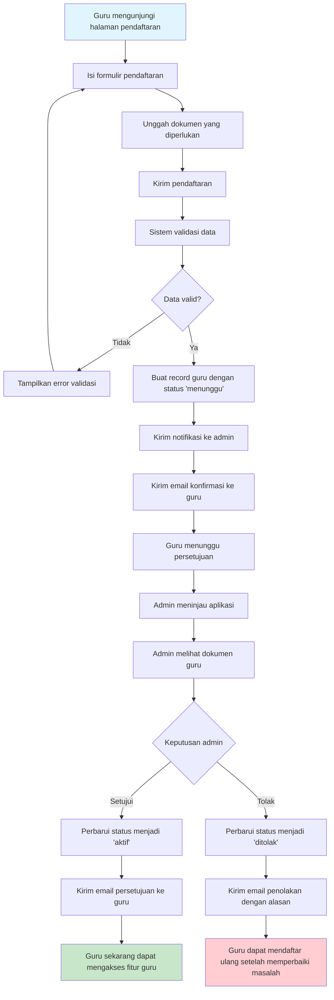
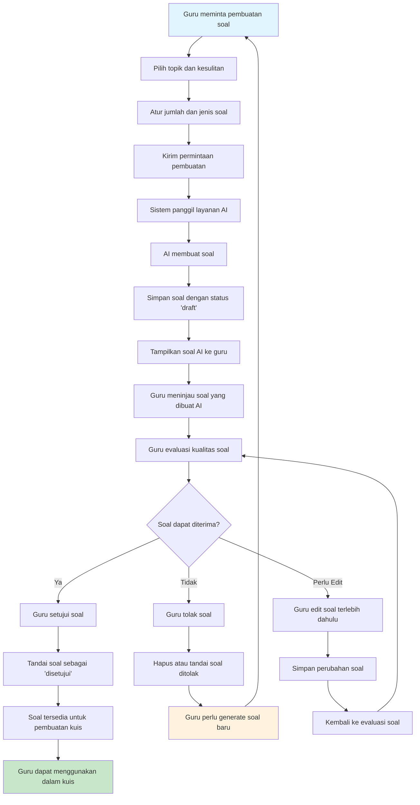
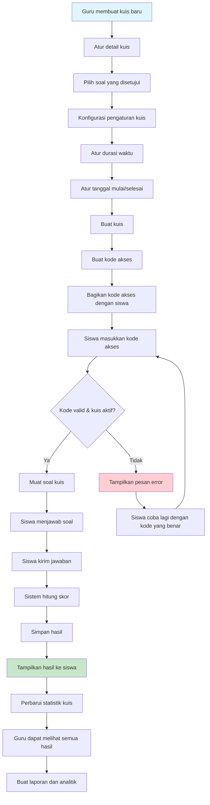
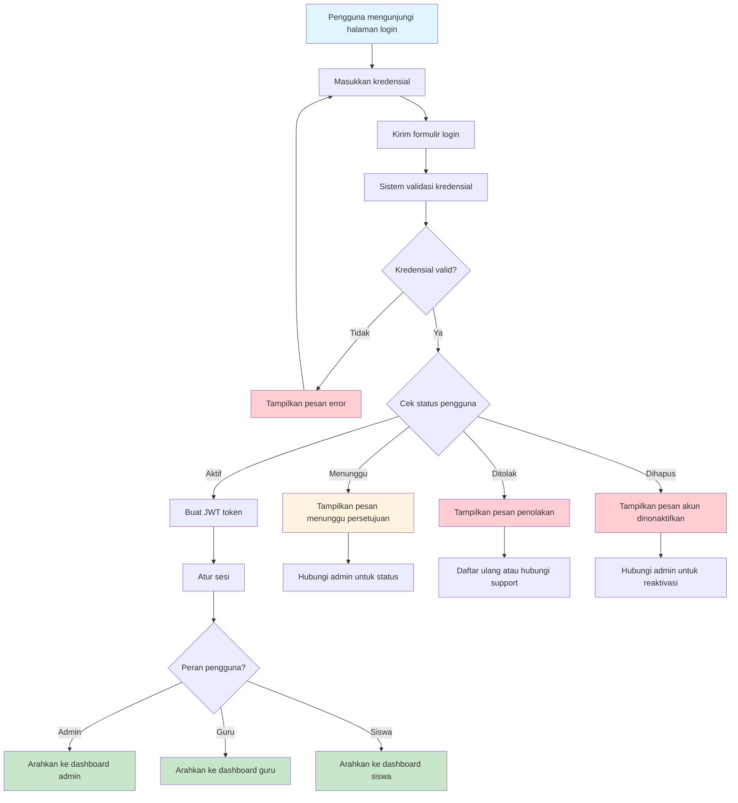
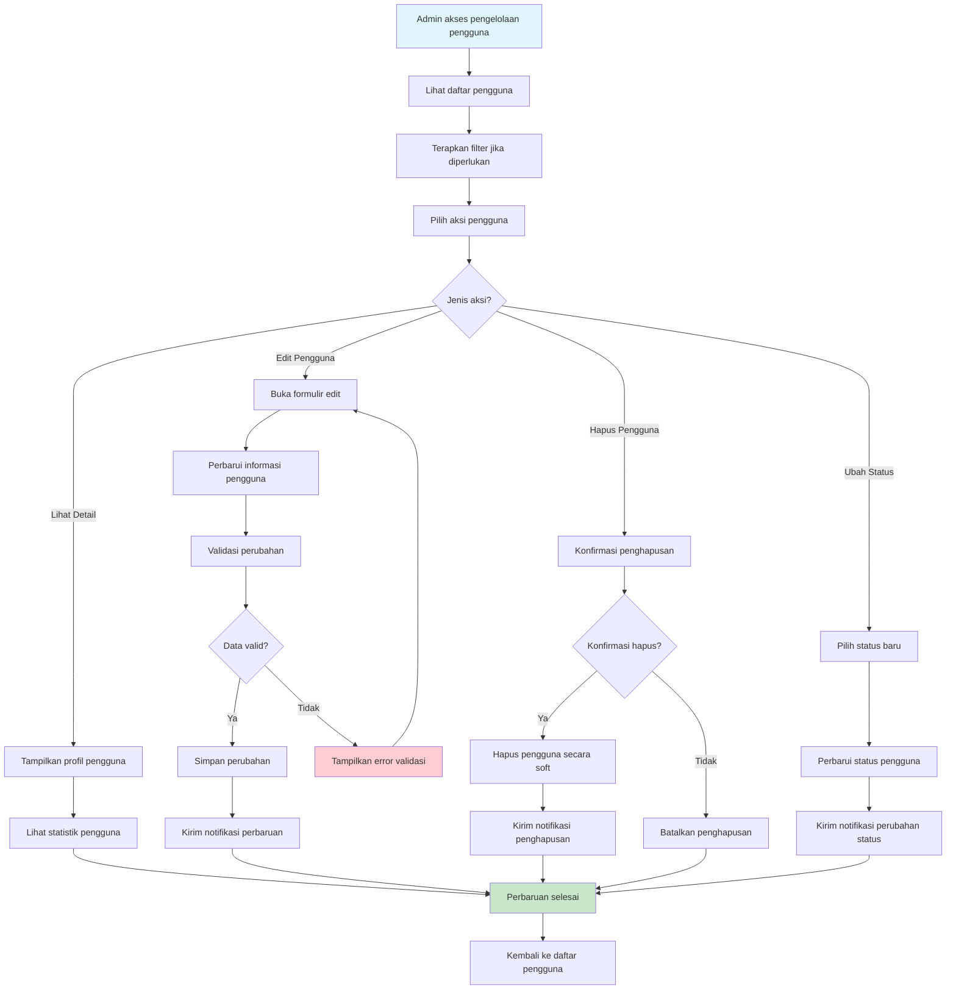
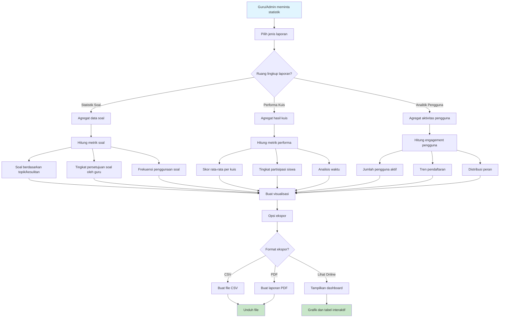

# Diagram Aktivitas - ExamExpert-AI

## 1. Proses Pendaftaran dan Persetujuan Guru

## 2. Proses Pembuatan dan Tinjauan Soal AI

## 3. Proses Pembuatan dan Eksekusi Kuis

## 4. Alur Autentikasi Pengguna

## 5. Proses Pengelolaan Pengguna Admin

## 6. Proses Statistik dan Analitik Soal

