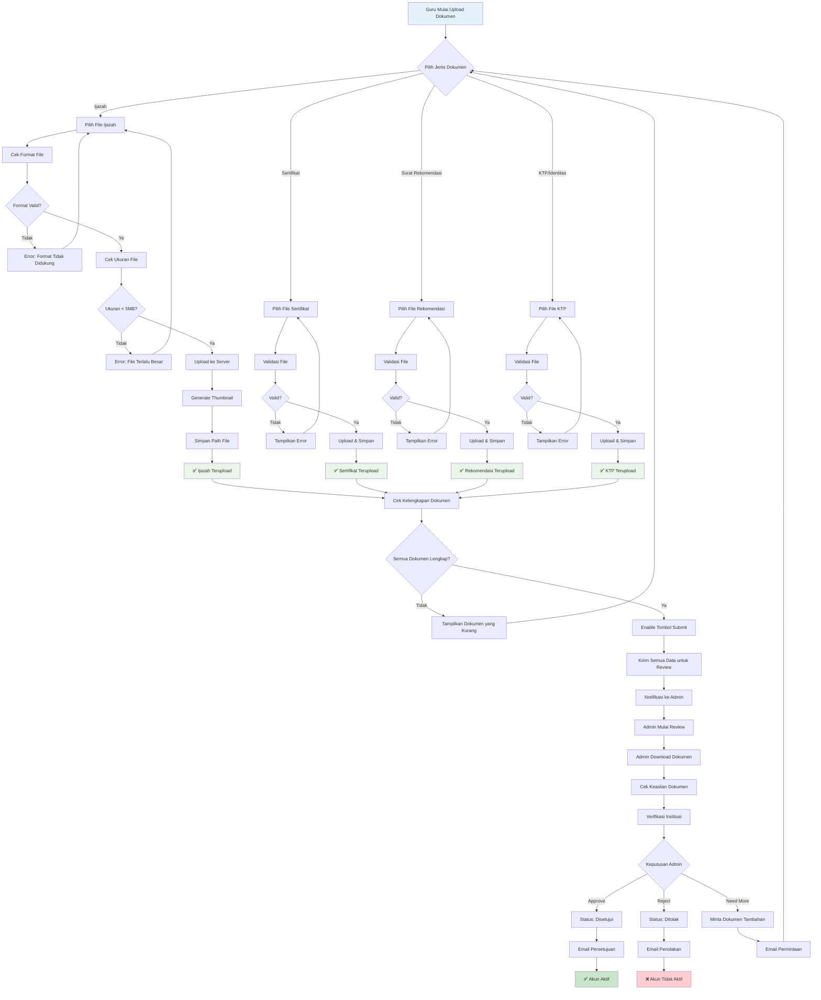

# Diagram Aktivitas - ExamExpert-AI

## Daftar Isi
1. [Proses Pendaftaran dan Persetujuan Guru](#1-proses-pendaftaran-dan-persetujuan-guru)
2. [Proses Pembuatan dan Tinjauan Soal AI](#2-proses-pembuatan-dan-tinjauan-soal-ai)
3. [Proses Pembuatan dan Eksekusi Kuis](#3-proses-pembuatan-dan-eksekusi-kuis)
4. [Alur Autentikasi Pengguna](#4-alur-autentikasi-pengguna)
5. [Proses Pengelolaan Pengguna Admin](#5-proses-pengelolaan-pengguna-admin)
6. [Proses Statistik dan Analitik Soal](#6-proses-statistik-dan-analitik-soal)
7. [Proses Registrasi Pengguna (Perbandingan Siswa vs Guru)](#7-proses-registrasi-pengguna-perbandingan-siswa-vs-guru)
8. [Detail Aktivitas Upload dan Verifikasi Dokumen Guru](#8-detail-aktivitas-upload-dan-verifikasi-dokumen-guru)

---

## 1. Proses Pendaftaran dan Persetujuan Guru

## 2. Proses Pembuatan dan Tinjauan Soal AI

## 3. Proses Pembuatan dan Eksekusi Kuis

## 4. Alur Autentikasi Pengguna

## 5. Proses Pengelolaan Pengguna Admin

## 6. Proses Statistik dan Analitik Soal

## 7. Proses Registrasi Pengguna (Perbandingan Siswa vs Guru)

## 8. Detail Aktivitas Upload dan Verifikasi Dokumen Guru

