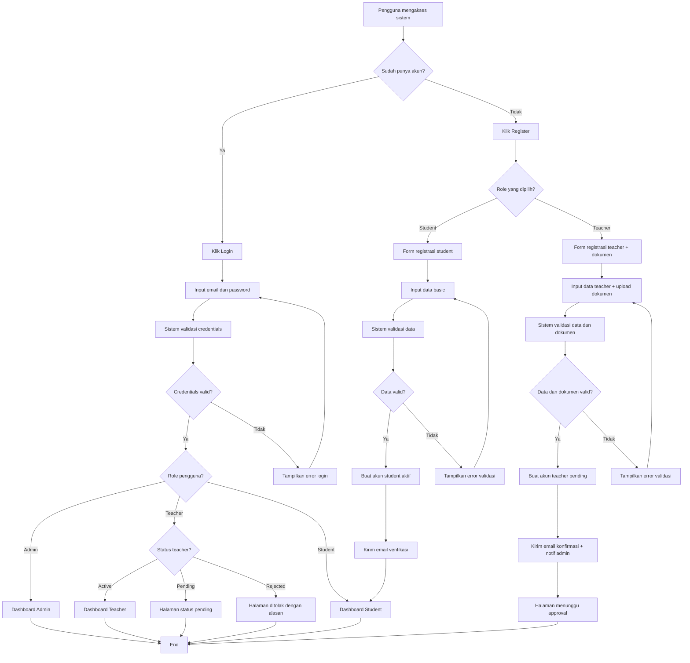
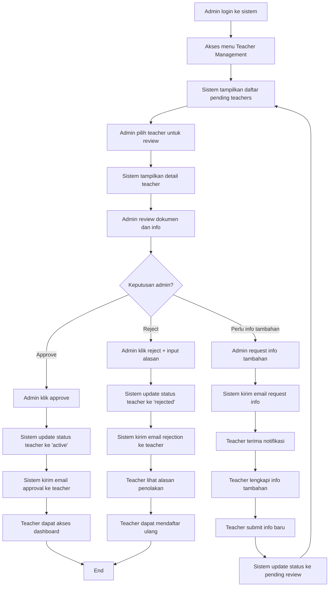
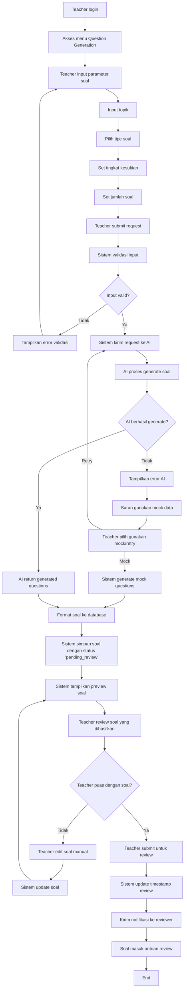
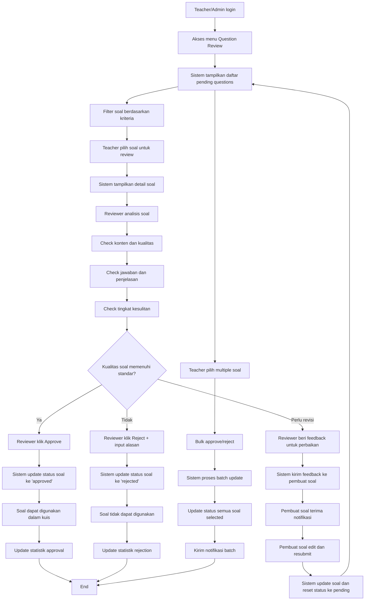
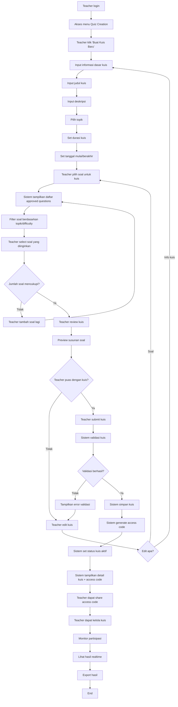
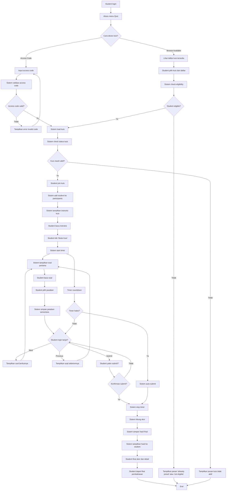
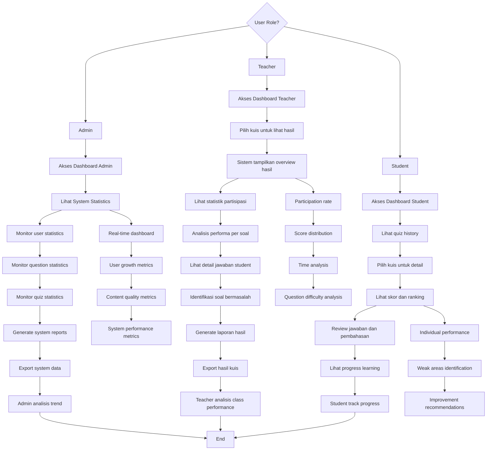
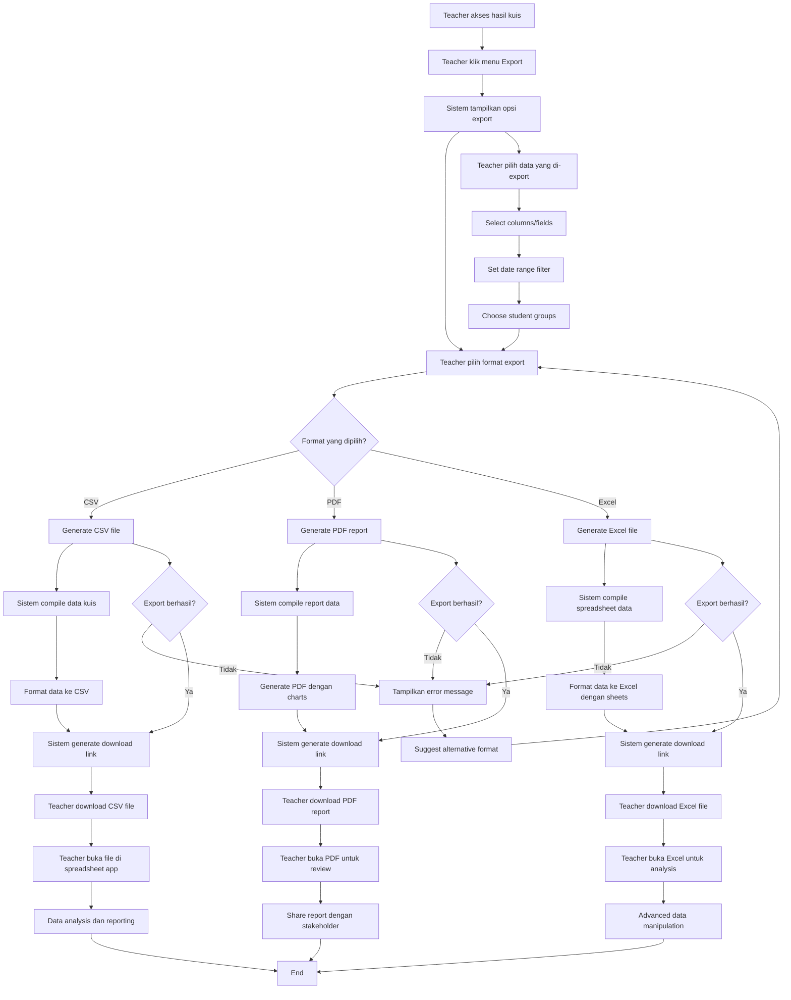

# Activity Diagram - Sistem ExamExpert-AI

Dokumen ini berisi activity diagram lengkap untuk semua proses utama dalam sistem ExamExpert-AI.

## Daftar Isi

1. [Activity Diagram Registrasi dan Login](#1-activity-diagram-registrasi-dan-login)
2. [Activity Diagram Approval Teacher oleh Admin](#2-activity-diagram-approval-teacher-oleh-admin)
3. [Activity Diagram Pembuatan Soal dengan AI](#3-activity-diagram-pembuatan-soal-dengan-ai)
4. [Activity Diagram Review dan Approval Soal](#4-activity-diagram-review-dan-approval-soal)
5. [Activity Diagram Pembuatan Kuis](#5-activity-diagram-pembuatan-kuis)
6. [Activity Diagram Partisipasi Kuis oleh Student](#6-activity-diagram-partisipasi-kuis-oleh-student)
7. [Activity Diagram Melihat Hasil dan Statistik](#7-activity-diagram-melihat-hasil-dan-statistik)
8. [Activity Diagram Ekspor Hasil Kuis](#8-activity-diagram-ekspor-hasil-kuis)

---

## 1. Activity Diagram Registrasi dan Login

### Detail Aktivitas Registrasi dan Login

#### A. Proses Login
1. **Input Credentials**: Pengguna memasukkan email dan password
2. **Validasi**: Sistem memverifikasi credentials dengan database
3. **Role Check**: Sistem mengecek role dan status pengguna
4. **Redirect**: Pengguna diarahkan ke dashboard sesuai role dan status

#### B. Proses Registrasi Student
1. **Form Input**: Mengisi nama, email, password
2. **Validasi**: Sistem mengecek format email, kekuatan password
3. **Akun Aktif**: Student langsung dapat menggunakan sistem
4. **Email Verifikasi**: Opsional untuk verifikasi email

#### C. Proses Registrasi Teacher
1. **Form Lengkap**: Data personal + informasi institusi
2. **Upload Dokumen**: Sertifikat, CV, dokumen pendukung
3. **Status Pending**: Akun menunggu approval admin
4. **Notifikasi**: Email ke teacher dan notifikasi ke admin

---

## 2. Activity Diagram Approval Teacher oleh Admin

### Detail Aktivitas Approval Teacher

#### A. Review Process
1. **Akses Dashboard**: Admin melihat daftar teacher pending
2. **Detail Review**: Memeriksa dokumen, CV, dan informasi institusi
3. **Verifikasi**: Cross-check dengan institusi terkait (opsional)
4. **Keputusan**: Approve, reject, atau minta info tambahan

#### B. Approval Actions
1. **Approve**: Teacher dapat langsung menggunakan sistem
2. **Reject**: Teacher diberi alasan dan dapat mendaftar ulang
3. **Request Info**: Teacher diminta melengkapi data

#### C. Notification System
1. **Email Otomatis**: Dikirim untuk setiap perubahan status
2. **Dashboard Update**: Status realtime di dashboard teacher
3. **Admin Log**: Semua aksi admin tercatat untuk audit

---

## 3. Activity Diagram Pembuatan Soal dengan AI

### Detail Aktivitas Pembuatan Soal dengan AI

#### A. Parameter Input
1. **Topik**: Mata pelajaran atau sub-topik spesifik
2. **Tipe Soal**: Multiple choice, true/false, atau essay
3. **Tingkat Kesulitan**: Easy, medium, hard
4. **Jumlah Soal**: 1-20 soal per request
5. **Konteks Tambahan**: Opsional untuk customization

#### B. AI Processing
1. **API Call**: Request ke service AI eksternal (Perplexity)
2. **Prompt Engineering**: Template prompt disesuaikan dengan parameter
3. **Response Parsing**: Extract soal dari response AI
4. **Quality Check**: Validasi format dan konten soal
5. **Fallback**: Mock data jika AI gagal

#### C. Quality Control
1. **Preview System**: Teacher dapat review sebelum submit
2. **Edit Capability**: Teacher dapat edit soal hasil AI
3. **Pending Status**: Soal menunggu approval sebelum dapat digunakan
4. **Review Queue**: Masuk antrian untuk review oleh teacher lain/admin

---

## 4. Activity Diagram Review dan Approval Soal

### Detail Aktivitas Review dan Approval Soal

#### A. Review Criteria
1. **Konten Accuracy**: Kebenaran materi dan informasi
2. **Language Quality**: Tata bahasa dan kejelasan bahasa
3. **Difficulty Alignment**: Kesesuaian tingkat kesulitan
4. **Answer Validity**: Kebenaran kunci jawaban
5. **Educational Value**: Nilai edukasi dan pembelajaran

#### B. Review Actions
1. **Approve**: Soal langsung dapat digunakan dalam kuis
2. **Reject**: Soal ditolak dengan alasan spesifik
3. **Request Revision**: Feedback untuk perbaikan soal
4. **Bulk Operations**: Approve/reject multiple soal sekaligus

#### C. Feedback System
1. **Detailed Comments**: Reviewer dapat beri komentar spesifik
2. **Improvement Suggestions**: Saran perbaikan untuk pembuat soal
3. **Quality Scoring**: Optional scoring system untuk kualitas soal
4. **Revision Tracking**: History perubahan dan revisi soal

---

## 5. Activity Diagram Pembuatan Kuis

### Detail Aktivitas Pembuatan Kuis

#### A. Setup Kuis
1. **Basic Information**: Judul, deskripsi, topik
2. **Timing**: Durasi pengerjaan, periode aktif kuis
3. **Configuration**: Setting khusus (shuffle questions, show results, dll)
4. **Access Control**: Public atau private dengan access code

#### B. Question Selection
1. **Filtered Browse**: Cari soal berdasarkan topik, difficulty, type
2. **Preview Questions**: Lihat detail soal sebelum menambahkan
3. **Drag & Drop**: Atur urutan soal dalam kuis
4. **Question Pool**: Opsi random selection dari pool soal

#### C. Kuis Management
1. **Access Code**: Generate unique code untuk student access
2. **Status Control**: Aktifkan/non-aktifkan kuis
3. **Real-time Monitoring**: Lihat siapa saja yang sedang mengerjakan
4. **Result Access**: Instant access ke hasil dan statistik

---

## 6. Activity Diagram Partisipasi Kuis oleh Student

### Detail Aktivitas Partisipasi Kuis

#### A. Access Methods
1. **Access Code**: Input 6-digit code yang dibagikan teacher
2. **Public Browse**: Lihat kuis public yang tersedia
3. **Direct Link**: Akses via link langsung dari teacher
4. **Scheduled Quiz**: Kuis yang dijadwalkan otomatis muncul

#### B. Quiz Execution
1. **Pre-Quiz**: Instruksi, rules, dan informasi durasi
2. **Navigation**: Previous/next question, question numbering
3. **Auto-Save**: Jawaban tersimpan otomatis setiap perubahan
4. **Timer Management**: Countdown timer dengan warning alerts
5. **Auto-Submit**: Otomatis submit saat waktu habis

#### C. Result Display
1. **Immediate Scoring**: Skor langsung tampil untuk objective questions
2. **Answer Review**: Lihat jawaban benar/salah dengan penjelasan
3. **Performance Stats**: Statistik waktu pengerjaan dan akurasi
4. **Ranking**: Posisi relatif terhadap participant lain (opsional)

---

## 7. Activity Diagram Melihat Hasil dan Statistik

### Detail Aktivitas Melihat Hasil dan Statistik

#### A. Admin Analytics
1. **System Overview**: Total users, quizzes, questions
2. **User Growth**: Registration trends, activation rates
3. **Content Analytics**: Question approval rates, quiz creation
4. **Performance Metrics**: System response time, error rates
5. **Usage Patterns**: Peak hours, popular features

#### B. Teacher Analytics
1. **Quiz Performance**: Participation rate, completion rate
2. **Score Analysis**: Average scores, distribution, outliers
3. **Question Analytics**: Most difficult/easy questions
4. **Student Progress**: Individual and class progress tracking
5. **Time Analysis**: Average completion time, time per question

#### C. Student Analytics
1. **Personal Performance**: Scores, accuracy, improvement over time
2. **Subject Analysis**: Strength and weakness per topic
3. **Comparison**: Performance vs class average
4. **Learning Path**: Recommended areas for improvement
5. **Achievement**: Badges, milestones, progress tracking

---

## 8. Activity Diagram Ekspor Hasil Kuis

### Detail Aktivitas Ekspor Hasil Kuis

#### A. Export Options
1. **Format Selection**: CSV, PDF, Excel dengan template berbeda
2. **Data Customization**: Pilih kolom/field yang ingin di-export
3. **Filter Options**: Date range, student groups, score range
4. **Template Choice**: Summary report, detailed analysis, raw data

#### B. CSV Export
1. **Student Data**: Name, email, score, completion time
2. **Answer Details**: Per question response dan correctness
3. **Timestamps**: Join time, completion time, time per question
4. **Compatibility**: Format yang compatible dengan Excel, Google Sheets

#### C. PDF Report
1. **Executive Summary**: Overview statistik dan key metrics
2. **Visualizations**: Charts untuk score distribution, time analysis
3. **Detailed Results**: Table hasil per student
4. **Recommendations**: Analysis insights dan action items

#### D. Excel Export
1. **Multiple Sheets**: Summary, detailed results, raw data
2. **Formulas**: Pre-built formulas untuk analysis
3. **Charts**: Embedded charts dan pivot tables
4. **Formatting**: Professional formatting dengan conditional formatting

## Kesimpulan

Activity diagram di atas menggambarkan alur kerja lengkap sistem ExamExpert-AI yang mencakup:

1. **User Management**: Registrasi, login, dan approval workflow
2. **Content Creation**: AI-powered question generation dan review system
3. **Assessment Delivery**: Quiz creation dan student participation
4. **Analytics & Reporting**: Comprehensive analytics dan export capabilities

Setiap diagram dirancang untuk memberikan visibilitas yang jelas terhadap:
- **Decision Points**: Titik-titik keputusan dalam setiap proses
- **Error Handling**: Penanganan error dan alternative flows
- **User Experience**: Smooth user journey untuk semua role
- **Data Flow**: Bagaimana data mengalir antar sistem components

Implementasi yang sudah ada telah mengcover hampir semua activity yang digambarkan, dengan beberapa enhancement yang bisa ditambahkan untuk fitur advanced seperti PDF export dan real-time notifications.
