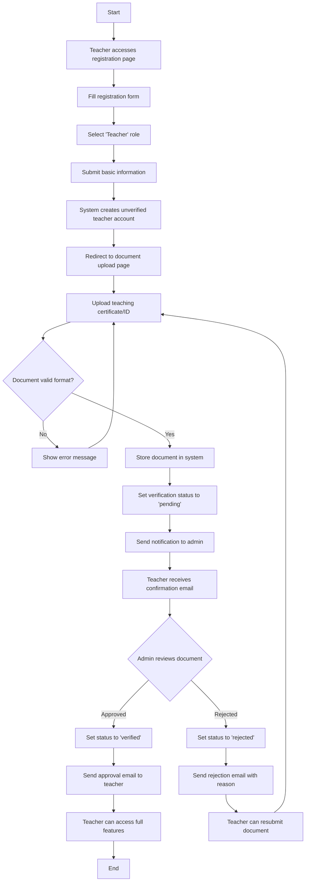
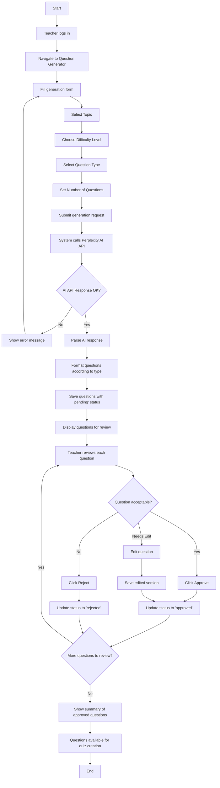
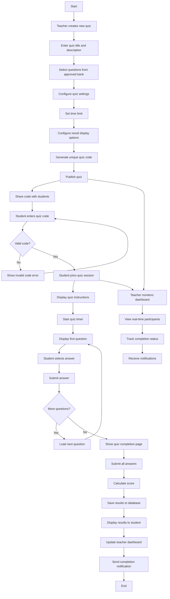
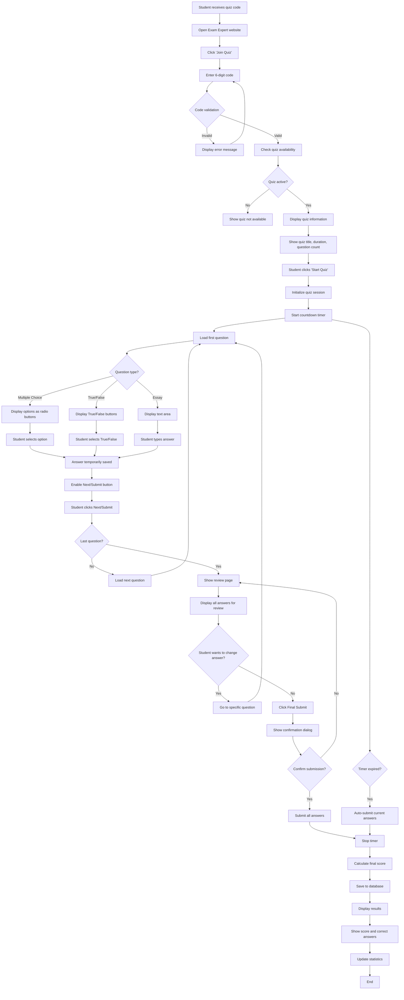
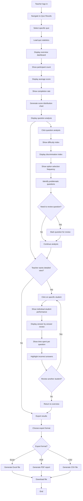
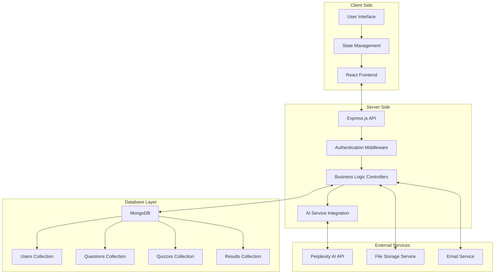
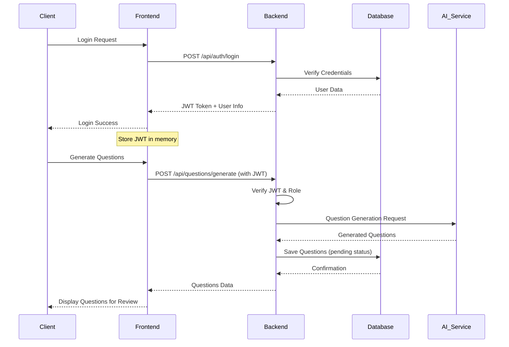
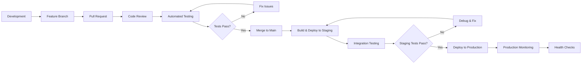

# PROPOSAL TUGAS AKHIR

## SISTEM MANAJEMEN UJIAN BERBASIS AI "EXAM EXPERT"

---

**Nama Mahasiswa:** [Nama Mahasiswa]  
**NIM:** [NIM]  
**Program Studi:** [Program Studi]  
**Fakultas:** [Fakultas]  
**Universitas:** [Universitas]

---

## BAB I
## PENDAHULUAN

### 1.1 Latar Belakang

Dalam era digital saat ini, proses pembelajaran dan evaluasi pendidikan mengalami transformasi yang signifikan. Salah satu tantangan utama yang dihadapi oleh para pengajar adalah pembuatan soal ujian yang berkualitas, variatif, dan sesuai dengan tingkat kesulitan yang diinginkan. Proses pembuatan soal secara manual membutuhkan waktu yang cukup lama dan seringkali menghasilkan pertanyaan yang monoton atau kurang bervariasi.

Perkembangan teknologi Artificial Intelligence (AI) memberikan solusi inovatif untuk mengatasi permasalahan tersebut. Dengan memanfaatkan AI, proses pembuatan soal dapat dipercepat secara signifikan sambil tetap mempertahankan kualitas dan relevansi pertanyaan. AI dapat menghasilkan berbagai jenis soal seperti pilihan ganda, benar/salah, dan essay dengan tingkat kesulitan yang dapat disesuaikan.

Sistem "Exam Expert" dikembangkan untuk menjembatani kebutuhan pengajar dalam membuat soal ujian yang efisien dan efektif. Sistem ini mengintegrasikan teknologi AI untuk generate soal secara otomatis, dilengkapi dengan fitur filtering yang memungkinkan pengajar untuk memilih soal terbaik sesuai dengan kriteria yang diinginkan. Selain itu, sistem ini juga menyediakan platform untuk melaksanakan ujian online dan monitoring hasil belajar siswa secara real-time.

Dengan adanya sistem ini, diharapkan proses pembuatan dan pelaksanaan ujian menjadi lebih efisien, kualitas soal terjaga, dan pengalaman belajar siswa dapat ditingkatkan melalui evaluasi yang lebih komprehensif dan terstruktur.

### 1.2 Rumusan Masalah

Berdasarkan latar belakang yang telah diuraikan, dapat diidentifikasi beberapa permasalahan sebagai berikut:

1. Bagaimana merancang sistem yang dapat menghasilkan soal ujian secara otomatis menggunakan teknologi AI?
2. Bagaimana mengimplementasikan sistem verifikasi untuk membedakan antara pelajar dan pengajar dalam platform?
3. Bagaimana merancang antarmuka yang memungkinkan pengajar untuk melakukan filtering terhadap soal yang dihasilkan AI?
4. Bagaimana mengembangkan sistem manajemen kuis yang memungkinkan pengajar membuat ujian dan pelajar mengikuti ujian dengan mudah?
5. Bagaimana merancang sistem monitoring dan statistik yang dapat memberikan insight kepada pengajar dan pelajar tentang hasil belajar?

### 1.3 Tujuan Penelitian

#### 1.3.1 Tujuan Umum
Mengembangkan sistem manajemen ujian berbasis AI yang dapat mempercepat proses pembuatan soal dan meningkatkan efisiensi pelaksanaan ujian online.

#### 1.3.2 Tujuan Khusus
1. Merancang dan mengimplementasikan sistem generate soal otomatis menggunakan API Perplexity AI
2. Mengembangkan sistem autentikasi dan otorisasi dengan verifikasi dokumen untuk pengajar
3. Membangun fitur filtering soal yang memungkinkan pengajar memilih soal berkualitas
4. Mengimplementasikan sistem manajemen kuis dengan kode akses untuk pelajar
5. Mengembangkan dashboard statistik dan monitoring hasil ujian untuk pengajar dan pelajar

### 1.4 Manfaat Penelitian

#### 1.4.1 Manfaat Akademis
1. Memberikan kontribusi dalam pengembangan aplikasi web berbasis AI untuk bidang pendidikan
2. Menjadi referensi untuk penelitian selanjutnya terkait implementasi AI dalam sistem evaluasi pembelajaran
3. Mendemonstrasikan penerapan teknologi modern dalam memecahkan masalah di bidang pendidikan

#### 1.4.2 Manfaat Praktis
1. **Bagi Pengajar:**
   - Menghemat waktu dalam pembuatan soal ujian
   - Meningkatkan variasi dan kualitas soal
   - Memudahkan monitoring dan evaluasi hasil belajar siswa
   - Menyediakan platform ujian online yang terintegrasi

2. **Bagi Pelajar:**
   - Memberikan pengalaman ujian online yang user-friendly
   - Menyediakan feedback langsung hasil ujian
   - Memungkinkan akses ujian dari berbagai perangkat

3. **Bagi Institusi Pendidikan:**
   - Meningkatkan efisiensi proses evaluasi pembelajaran
   - Mengurangi biaya operasional ujian
   - Mendukung digitalisasi sistem pendidikan

### 1.5 Ruang Lingkup Penelitian

Penelitian ini dibatasi pada:

1. **Teknologi yang Digunakan:**
   - Backend: Node.js dengan Express.js
   - Database: MongoDB
   - Frontend: Vite React dengan TypeScript
   - AI Integration: Perplexity API

2. **Fitur Utama:**
   - Sistem registrasi dan verifikasi pengguna
   - Generate soal otomatis dengan AI
   - Filtering dan approval soal
   - Manajemen kuis dengan kode akses
   - Dashboard statistik dan monitoring

3. **Jenis Soal:**
   - Pilihan ganda (multiple choice)
   - Benar/Salah (true/false)
   - Essay

4. **Pengguna Target:**
   - Pengajar (dengan verifikasi dokumen)
   - Pelajar

### 1.6 Sistematika Penulisan

**BAB I PENDAHULUAN**  
Berisi latar belakang, rumusan masalah, tujuan penelitian, manfaat penelitian, ruang lingkup penelitian, dan sistematika penulisan.

**BAB II LANDASAN TEORI**  
Berisi teori-teori yang mendukung penelitian, tinjauan pustaka, dan kerangka pemikiran.

**BAB III METODOLOGI PENELITIAN**  
Berisi metode penelitian, analisis kebutuhan sistem, perancangan sistem, dan diagram-diagram sistem.

**BAB IV IMPLEMENTASI DAN PENGUJIAN**  
Berisi implementasi sistem, pengujian fungsionalitas, dan analisis hasil pengujian.

**BAB V PENUTUP**  
Berisi kesimpulan dan saran untuk pengembangan lebih lanjut.

---

## BAB II
## LANDASAN TEORI

### 2.1 Artificial Intelligence (AI) dalam Pendidikan

#### 2.1.1 Definisi Artificial Intelligence
Artificial Intelligence (AI) adalah cabang ilmu komputer yang bertujuan untuk menciptakan sistem yang dapat melakukan tugas-tugas yang biasanya memerlukan kecerdasan manusia. Dalam konteks pendidikan, AI dapat digunakan untuk mengotomatisasi proses pembelajaran, evaluasi, dan pembuatan konten edukatif.

#### 2.1.2 Perplexity AI
Perplexity AI adalah platform AI yang menyediakan layanan untuk menghasilkan konten tekstual berkualitas tinggi. API Perplexity memungkinkan developer untuk mengintegrasikan kemampuan AI dalam aplikasi mereka untuk berbagai keperluan, termasuk pembuatan soal ujian yang kontekstual dan relevan.

**Keunggulan Perplexity AI:**
- Kemampuan pemahaman konteks yang baik
- Dapat menghasilkan berbagai jenis pertanyaan
- Mendukung multiple format output
- Response time yang relatif cepat
- API yang mudah diintegrasikan

#### 2.1.3 Implementasi AI dalam Generate Soal
Proses generate soal menggunakan AI melibatkan beberapa parameter input:
- **Topic**: Mata pelajaran atau topik spesifik
- **Difficulty Level**: Tingkat kesulitan (mudah, sedang, sulit)
- **Question Type**: Jenis pertanyaan (pilihan ganda, benar/salah, essay)
- **Context**: Konteks atau kurikulum yang digunakan

### 2.2 Teknologi Web Development

#### 2.2.1 Node.js dan Express.js
**Node.js** adalah runtime environment JavaScript yang memungkinkan eksekusi kode JavaScript di server-side. Node.js menggunakan event-driven, non-blocking I/O model yang membuatnya efisien dan cocok untuk aplikasi real-time.

**Express.js** adalah web framework minimal dan fleksibel untuk Node.js yang menyediakan fitur-fitur robust untuk membangun aplikasi web dan API.

**Keunggulan Node.js + Express.js:**
- Performance tinggi untuk aplikasi real-time
- Ekosistem npm yang luas
- JavaScript di frontend dan backend
- Mudah untuk membangun RESTful API
- Mendukung middleware yang fleksibel

#### 2.2.2 MongoDB
MongoDB adalah database NoSQL berbasis dokumen yang menyimpan data dalam format BSON (Binary JSON). MongoDB sangat cocok untuk aplikasi modern yang membutuhkan fleksibilitas schema dan skalabilitas horizontal.

**Keunggulan MongoDB:**
- Schema fleksibel
- Horizontal scaling
- High performance untuk read/write operations
- Rich query language
- Built-in replication dan sharding

**Struktur Data dalam Exam Expert:**
```javascript
// User Schema
{
  _id: ObjectId,
  email: String,
  password: String,
  role: String, // 'teacher' | 'student'
  profile: {
    name: String,
    institution: String,
    verificationStatus: String // untuk teacher
  }
}

// Question Schema
{
  _id: ObjectId,
  question: String,
  type: String, // 'multiple_choice' | 'true_false' | 'essay'
  options: [String], // untuk multiple choice
  correctAnswer: String,
  difficulty: String,
  topic: String,
  createdBy: ObjectId,
  isApproved: Boolean
}

// Quiz Schema
{
  _id: ObjectId,
  title: String,
  code: String,
  questions: [ObjectId],
  createdBy: ObjectId,
  settings: {
    timeLimit: Number,
    allowRetake: Boolean,
    showResults: Boolean
  }
}
```

#### 2.2.3 React dengan TypeScript
**React** adalah library JavaScript untuk membangun user interface yang dikembangkan oleh Facebook. React menggunakan komponen-komponen yang dapat digunakan kembali dan virtual DOM untuk performa yang optimal.

**TypeScript** adalah superset dari JavaScript yang menambahkan static typing. TypeScript membantu dalam pengembangan aplikasi yang lebih maintainable dan mengurangi bug pada runtime.

**Keunggulan React + TypeScript:**
- Type safety dan better IDE support
- Component-based architecture
- Virtual DOM untuk performa optimal
- Rich ecosystem dan community support
- Mudah untuk testing dan debugging

#### 2.2.4 Vite
Vite adalah build tool modern untuk frontend development yang memberikan pengalaman development yang lebih cepat dengan hot module replacement (HMR) yang instant.

**Keunggulan Vite:**
- Startup server yang sangat cepat
- Hot Module Replacement (HMR) yang instant
- Build yang dioptimasi dengan Rollup
- Support untuk TypeScript out-of-the-box
- Plugin ecosystem yang rich

### 2.3 Sistem Manajemen Pembelajaran Online

#### 2.3.1 Learning Management System (LMS)
LMS adalah platform software yang digunakan untuk mengelola, melacak, dan menyampaikan program pembelajaran online. Komponen utama LMS meliputi:
- User management
- Content management
- Assessment tools
- Progress tracking
- Reporting dan analytics

#### 2.3.2 Computer-Based Testing (CBT)
CBT adalah metode evaluasi yang menggunakan komputer sebagai medium untuk menyajikan soal dan mengumpulkan jawaban. Keunggulan CBT:
- Automated scoring
- Instant feedback
- Multimedia support
- Adaptive testing capabilities
- Reduced paper usage

#### 2.3.3 Authentication dan Authorization
**Authentication** adalah proses verifikasi identitas pengguna, sedangkan **Authorization** adalah proses menentukan hak akses pengguna terhadap resource tertentu.

**Implementasi dalam Exam Expert:**
- JWT (JSON Web Token) untuk session management
- Role-based access control (RBAC)
- Document verification untuk teacher registration
- Secure password hashing dengan bcrypt

### 2.4 User Experience (UX) Design

#### 2.4.1 Prinsip-prinsip UX Design
1. **Usability**: Kemudahan penggunaan sistem
2. **Accessibility**: Dapat diakses oleh berbagai pengguna
3. **Consistency**: Konsistensi dalam design dan interaksi
4. **Feedback**: Memberikan feedback yang jelas kepada pengguna
5. **Error Prevention**: Mencegah dan menangani error dengan baik

#### 2.4.2 Responsive Web Design
Responsive design memastikan aplikasi web dapat bekerja optimal di berbagai ukuran layar dan perangkat. Teknik yang digunakan:
- Flexible grid layouts
- Media queries
- Flexible images dan media
- Mobile-first approach

### 2.5 Security Considerations

#### 2.5.1 Web Application Security
Aspek keamanan yang perlu diperhatikan dalam pengembangan web application:
- Input validation dan sanitization
- SQL/NoSQL injection prevention
- Cross-Site Scripting (XSS) protection
- Cross-Site Request Forgery (CSRF) protection
- Secure session management
- HTTPS implementation

#### 2.5.2 Data Privacy dan Protection
Dalam konteks aplikasi pendidikan, perlindungan data pengguna sangat penting:
- Encryption untuk data sensitif
- Secure file upload untuk document verification
- Privacy policy dan terms of service
- GDPR compliance considerations

### 2.6 Tinjauan Pustaka

#### 2.6.1 Penelitian Terkait AI dalam Pendidikan
Beberapa penelitian menunjukkan efektivitas penggunaan AI dalam bidang pendidikan:

1. **"Automated Question Generation for Educational Assessment"** (Chen et al., 2020) menunjukkan bahwa AI dapat menghasilkan soal dengan kualitas yang sebanding dengan soal buatan manusia.

2. **"AI-Powered Learning Management Systems: A Systematic Review"** (Rodriguez et al., 2021) mengidentifikasi bahwa integrasi AI dalam LMS dapat meningkatkan engagement dan learning outcomes siswa.

#### 2.6.2 Comparison dengan Sistem Existing
Perbandingan dengan platform existing seperti:

**Google Forms + Quizizz:**
- Kelebihan: Mudah digunakan, gratis
- Kekurangan: Terbatas dalam generate soal otomatis, tidak ada filtering system

**Kahoot:**
- Kelebihan: Interactive, gamification
- Kekurangan: Fokus pada real-time quiz, terbatas untuk assessment formal

**Moodle:**
- Kelebihan: Comprehensive LMS features
- Kekurangan: Complex setup, tidak ada AI integration untuk generate soal

**Exam Expert** memberikan unique value proposition dengan kombinasi AI-powered question generation dan intelligent filtering system yang belum ada di platform existing.

### 2.7 Kerangka Pemikiran

Kerangka pemikiran penelitian ini didasarkan pada identifikasi masalah dalam proses pembuatan dan pelaksanaan ujian tradisional, kemudian menggunakan teknologi AI dan web development modern untuk menciptakan solusi yang efisien dan efektif.

**Alur Pemikiran:**
1. **Problem Identification**: Proses manual pembuatan soal yang memakan waktu
2. **Technology Solution**: Implementasi AI untuk automated question generation
3. **Quality Assurance**: Sistem filtering untuk memastikan kualitas soal
4. **User Experience**: Interface yang user-friendly untuk pengajar dan pelajar
5. **Assessment & Analytics**: Sistem monitoring dan statistik untuk improvement

Pendekatan ini menggabungkan prinsip-prinsip software engineering, user experience design, dan educational technology untuk menciptakan solusi yang komprehensif dan praktis.

---

## BAB III
## METODOLOGI PENELITIAN

### 3.1 Metode Penelitian

Penelitian ini menggunakan metode **Research and Development (R&D)** dengan pendekatan **Software Development Life Cycle (SDLC)** model **Agile Development**. Metode ini dipilih karena memungkinkan pengembangan sistem secara iteratif dan dapat beradaptasi dengan perubahan kebutuhan selama proses development.

**Tahapan penelitian meliputi:**
1. **Analisis Kebutuhan**: Identifikasi kebutuhan fungsional dan non-fungsional sistem
2. **Perancangan Sistem**: Desain arsitektur, database, dan user interface
3. **Implementasi**: Pengembangan sistem berdasarkan rancangan
4. **Testing**: Pengujian fungsionalitas sistem
5. **Evaluasi**: Analisis hasil dan perbaikan sistem

### 3.2 Analisis Kebutuhan Sistem

#### 3.2.1 Kebutuhan Fungsional

**Untuk Pengguna Umum:**
1. Registrasi akun dengan pilihan role (pelajar/pengajar)
2. Login dan logout sistem
3. Manajemen profil pengguna

**Untuk Pengajar:**
1. Verifikasi identitas dengan upload dokumen resmi
2. Generate soal otomatis dengan parameter:
   - Topic/mata pelajaran
   - Tingkat kesulitan (mudah, sedang, sulit)
   - Tipe pertanyaan (pilihan ganda, benar/salah, essay)
3. Review dan filtering soal yang dihasilkan AI:
   - Approve soal yang berkualitas
   - Reject soal yang tidak sesuai
   - Edit soal jika diperlukan
4. Membuat kuis dari soal-soal yang telah difilter
5. Generate kode akses kuis untuk dibagikan ke pelajar
6. Monitoring real-time peserta kuis
7. Melihat statistik dan hasil kuis:
   - Skor individual pelajar
   - Analisis per soal
   - Export hasil ke format file

**Untuk Pelajar:**
1. Join kuis menggunakan kode akses
2. Mengerjakan soal dengan timer
3. Submit jawaban
4. Melihat hasil dan skor
5. Review jawaban (jika diizinkan pengajar)
6. Melihat riwayat kuis yang pernah dikerjakan

#### 3.2.2 Kebutuhan Non-Fungsional

**Performance:**
- Response time maksimal 3 detik untuk generate soal
- Sistem dapat menangani minimal 100 pengguna bersamaan
- Database query optimization untuk large dataset

**Security:**
- Enkripsi password menggunakan bcrypt
- JWT token untuk session management
- Input validation dan sanitization
- Secure file upload untuk dokumen verifikasi
- HTTPS implementation

**Usability:**
- Interface yang intuitive dan responsive
- Support untuk desktop dan mobile devices
- Accessibility compliance (WCAG 2.1)
- Multi-language support (Indonesian/English)

**Reliability:**
- System uptime minimal 99%
- Automatic backup database
- Error handling dan logging
- Graceful degradation untuk offline mode

**Scalability:**
- Horizontal scaling capability
- Microservices architecture consideration
- CDN integration untuk static files
- Database sharding strategy

### 3.3 Perancangan Sistem

#### 3.3.1 Arsitektur Sistem

Sistem "Exam Expert" menggunakan arsitektur **3-tier** dengan pemisahan yang jelas antara presentation layer, business logic layer, dan data layer.

**Arsitektur Teknologi:**
```
Frontend (React + TypeScript + Vite)
├── Components
├── Hooks
├── Services (API calls)
├── Utils
└── Styles

Backend (Node.js + Express.js)
├── Controllers
├── Models
├── Middleware
├── Routes
├── Services (AI Integration)
└── Utils

Database (MongoDB)
├── Users Collection
├── Questions Collection
├── Quizzes Collection
├── Results Collection
└── Files Collection (GridFS)

External Services
└── Perplexity AI API
```

#### 3.3.2 Database Design

**Entity Relationship Diagram (ERD):**

**Users Collection:**
```javascript
{
  _id: ObjectId,
  email: String (unique),
  password: String (hashed),
  role: String, // 'teacher' | 'student'
  profile: {
    firstName: String,
    lastName: String,
    institution: String,
    phoneNumber: String
  },
  verification: { // only for teachers
    status: String, // 'pending' | 'verified' | 'rejected'
    documentUrl: String,
    verifiedAt: Date,
    verifiedBy: ObjectId
  },
  createdAt: Date,
  updatedAt: Date,
  isActive: Boolean
}
```

**Questions Collection:**
```javascript
{
  _id: ObjectId,
  question: String,
  type: String, // 'multiple_choice' | 'true_false' | 'essay'
  options: [String], // for multiple choice
  correctAnswer: String,
  explanation: String,
  difficulty: String, // 'easy' | 'medium' | 'hard'
  topic: String,
  subject: String,
  tags: [String],
  createdBy: ObjectId, // teacher who generated
  generatedBy: String, // 'ai' | 'manual'
  aiMetadata: {
    prompt: String,
    model: String,
    generatedAt: Date
  },
  status: String, // 'pending' | 'approved' | 'rejected'
  reviewedAt: Date,
  createdAt: Date,
  updatedAt: Date
}
```

**Quizzes Collection:**
```javascript
{
  _id: ObjectId,
  title: String,
  description: String,
  code: String (unique, 6 digits),
  questions: [ObjectId],
  createdBy: ObjectId,
  settings: {
    timeLimit: Number, // in minutes
    allowRetake: Boolean,
    showResults: Boolean,
    showCorrectAnswers: Boolean,
    randomizeQuestions: Boolean,
    randomizeOptions: Boolean,
    passingScore: Number
  },
  schedule: {
    startTime: Date,
    endTime: Date,
    timezone: String
  },
  status: String, // 'draft' | 'active' | 'completed' | 'archived'
  participants: [{
    userId: ObjectId,
    joinedAt: Date,
    completedAt: Date,
    status: String // 'joined' | 'completed' | 'timeout'
  }],
  createdAt: Date,
  updatedAt: Date
}
```

**Results Collection:**
```javascript
{
  _id: ObjectId,
  quizId: ObjectId,
  userId: ObjectId,
  answers: [{
    questionId: ObjectId,
    answer: String, // or [String] for multiple answers
    isCorrect: Boolean,
    timeSpent: Number, // in seconds
    points: Number
  }],
  score: {
    totalPoints: Number,
    maxPoints: Number,
    percentage: Number,
    grade: String
  },
  timing: {
    startedAt: Date,
    completedAt: Date,
    timeSpent: Number, // in seconds
    remainingTime: Number
  },
  metadata: {
    userAgent: String,
    ipAddress: String,
    deviceInfo: String
  },
  status: String, // 'in_progress' | 'completed' | 'timeout' | 'cheating_detected'
}
```

#### 3.3.3 API Design

**RESTful API Endpoints:**

**Authentication:**
```
POST /api/auth/register
POST /api/auth/login
POST /api/auth/logout
POST /api/auth/refresh-token
POST /api/auth/forgot-password
POST /api/auth/reset-password
```

**User Management:**
```
GET /api/users/profile
PUT /api/users/profile
POST /api/users/verify-teacher (upload document)
GET /api/users/verification-status
```

**Question Management:**
```
POST /api/questions/generate (AI generation)
GET /api/questions (with filtering)
GET /api/questions/:id
PUT /api/questions/:id/approve
PUT /api/questions/:id/reject
PUT /api/questions/:id (edit question)
DELETE /api/questions/:id
```

**Quiz Management:**
```
POST /api/quizzes (create quiz)
GET /api/quizzes (teacher's quizzes)
GET /api/quizzes/:id
PUT /api/quizzes/:id
DELETE /api/quizzes/:id
POST /api/quizzes/:id/publish
GET /api/quizzes/code/:code (join quiz)
```

**Quiz Participation:**
```
POST /api/quizzes/:id/join
GET /api/quizzes/:id/questions
POST /api/quizzes/:id/answers
GET /api/quizzes/:id/results
POST /api/quizzes/:id/submit
```

**Analytics:**
```
GET /api/analytics/quiz/:id/stats
GET /api/analytics/teacher/dashboard
GET /api/analytics/student/history
```

### 3.4 Use Case Diagram

```mermaid
graph TB
    Student[Student]
    Teacher[Teacher]
    Admin[Admin]
    AIService[Perplexity AI]
    
    %% Student Use Cases
    Student --> UC1[Register as Student]
    Student --> UC2[Login]
    Student --> UC3[Join Quiz with Code]
    Student --> UC4[Take Quiz]
    Student --> UC5[View Results]
    Student --> UC6[View Quiz History]
    
    %% Teacher Use Cases
    Teacher --> UC7[Register as Teacher]
    Teacher --> UC8[Upload Verification Document]
    Teacher --> UC9[Login]
    Teacher --> UC10[Generate Questions with AI]
    Teacher --> UC11[Review Generated Questions]
    Teacher --> UC12[Approve/Reject Questions]
    Teacher --> UC13[Create Quiz from Approved Questions]
    Teacher --> UC14[Generate Quiz Code]
    Teacher --> UC15[Monitor Quiz Sessions]
    Teacher --> UC16[View Student Results]
    Teacher --> UC17[Export Results]
    Teacher --> UC18[Manage Question Bank]
    
    %% Admin Use Cases (future enhancement)
    Admin --> UC19[Verify Teacher Documents]
    Admin --> UC20[Manage Users]
    Admin --> UC21[System Analytics]
    
    %% AI Service Integration
    UC10 --> AIService
    AIService --> UC22[Process Question Generation Request]
    AIService --> UC23[Return Generated Questions]
    
    %% Relationships
    UC7 -.-> UC8 : requires
    UC8 -.-> UC19 : triggers
    UC10 -.-> UC11 : followed by
    UC11 -.-> UC12 : followed by
    UC12 -.-> UC13 : enables
    UC13 -.-> UC14 : followed by
    UC3 -.-> UC4 : enables
    UC4 -.-> UC5 : followed by
```

### 3.5 Activity Diagram

#### 3.5.1 Teacher Registration and Verification Process



#### 3.5.2 AI Question Generation and Filtering Process



#### 3.5.3 Quiz Creation and Student Participation Process



#### 3.5.4 Student Quiz Taking Process (Detailed)



#### 3.5.5 Teacher Results Analysis Process



### 3.6 System Flow Diagram

#### 3.6.1 Overall System Architecture Flow



### 3.7 Security Architecture

#### 3.7.1 Authentication and Authorization Flow



### 3.8 Testing Strategy

#### 3.8.1 Testing Pyramid

**Unit Testing:**
- Individual function testing
- Component testing (React components)
- API endpoint testing
- Database model testing

**Integration Testing:**
- API integration with frontend
- Database integration
- AI service integration
- Authentication flow testing

**End-to-End Testing:**
- Complete user workflows
- Cross-browser compatibility
- Mobile responsiveness
- Performance testing

**Testing Tools:**
- **Frontend**: Jest, React Testing Library, Cypress
- **Backend**: Jest, Supertest, MongoDB Memory Server
- **E2E**: Cypress, Playwright
- **Performance**: Lighthouse, WebPageTest

#### 3.8.2 Test Cases Overview

**Authentication Tests:**
- Valid/invalid login attempts
- Password encryption verification
- JWT token validation
- Role-based access control

**Question Generation Tests:**
- AI API integration
- Question format validation
- Error handling for API failures
- Performance under load

**Quiz Management Tests:**
- Quiz creation workflow
- Code generation uniqueness
- Timer functionality
- Result calculation accuracy

**Security Tests:**
- SQL injection prevention
- XSS attack prevention
- CSRF protection
- File upload security

### 3.9 Deployment Architecture

#### 3.9.1 Production Environment Setup

```mermaid
flowchart TB
    subgraph "Load Balancer"
        A[Nginx Load Balancer]
    end
    
    subgraph "Application Servers"
        B[Node.js Server 1]
        C[Node.js Server 2]
        D[Node.js Server N]
    end
    
    subgraph "Database Cluster"
        E[MongoDB Primary]
        F[MongoDB Secondary 1]
        G[MongoDB Secondary 2]
    end
    
    subgraph "Storage"
        H[File Storage (GridFS/S3)]
        I[Redis Cache]
    end
    
    subgraph "Monitoring"
        J[Application Monitoring]
        K[Database Monitoring]
        L[Server Monitoring]
    end
    
    A --> B
    A --> C
    A --> D
    B --> E
    C --> E
    D --> E
    E --> F
    E --> G
    B --> I
    C --> I
    D --> I
    B --> H
    C --> H
    D --> H
    
    J --> B
    J --> C
    J --> D
    K --> E
    L --> A
```

#### 3.9.2 Development to Production Pipeline



### 3.10 Performance Optimization Strategy

#### 3.10.1 Frontend Optimization
- Code splitting dengan React.lazy
- Image optimization dan lazy loading
- Caching strategy dengan Service Workers
- Bundle size optimization
- CDN untuk static assets

#### 3.10.2 Backend Optimization
- Database indexing strategy
- Query optimization
- Response caching dengan Redis
- API rate limiting
- Connection pooling

#### 3.10.3 Database Optimization
- Proper indexing untuk frequently queried fields
- Aggregation pipeline optimization
- Data denormalization untuk read-heavy operations
- Sharding strategy untuk large datasets
- Regular database maintenance

### 3.11 Monitoring and Analytics

#### 3.11.1 Application Metrics
- Response time monitoring
- Error rate tracking
- User engagement metrics
- API usage statistics
- AI service performance metrics

#### 3.11.2 Business Metrics
- User registration trends
- Quiz creation and completion rates
- Question generation accuracy
- Teacher verification processing time
- Student performance analytics

### 3.12 Future Enhancements

#### 3.12.1 Phase 2 Features
- Advanced AI question generation with context understanding
- Proctoring capabilities dengan webcam monitoring
- Adaptive testing based on student performance
- Advanced analytics dan machine learning insights
- Mobile application development

#### 3.12.2 Phase 3 Features
- Multi-language support
- Integration dengan existing LMS platforms
- Advanced collaboration features
- Blockchain-based certificate verification
- AI-powered personalized learning recommendations

### 3.13 Risk Assessment dan Mitigation

#### 3.13.1 Technical Risks
- **AI Service Downtime**: Implementasi backup AI services dan offline mode
- **Database Performance**: Database optimization dan scaling strategy
- **Security Vulnerabilities**: Regular security audits dan penetration testing
- **Scalability Issues**: Cloud-based auto-scaling solution

#### 3.13.2 Business Risks
- **User Adoption**: User training dan comprehensive documentation
- **Competition**: Continuous feature development dan user feedback integration
- **Regulatory Compliance**: GDPR compliance dan data privacy measures
- **Cost Management**: Resource optimization dan cost monitoring

### 3.14 Jadwal Pelaksanaan Penelitian

Penelitian dan pengembangan sistem "Exam Expert" direncanakan akan dilaksanakan dalam periode 8 bulan dengan rincian sebagai berikut:

| No | Kegiatan | Bulan ke- | Durasi |
|----|----------|-----------|---------|
| 1 | **Tahap Persiapan dan Analisis** | | |
|   | - Studi literatur dan analisis kebutuhan | 1 | 4 minggu |
|   | - Survey kebutuhan pengajar (Google Form) | 1 | 2 minggu |
|   | - Analisis hasil survey dan requirements | 1-2 | 2 minggu |
| 2 | **Tahap Perancangan Sistem** | | |
|   | - Perancangan arsitektur sistem | 2 | 2 minggu |
|   | - Desain database dan API | 2 | 2 minggu |
|   | - Desain UI/UX mockup dan wireframe | 2-3 | 3 minggu |
|   | - Review dan finalisasi desain | 3 | 1 minggu |
| 3 | **Tahap Implementasi** | | |
|   | - Setup development environment | 3 | 1 minggu |
|   | - Implementasi backend (API + Database) | 3-4 | 4 minggu |
|   | - Implementasi frontend (React Interface) | 4-5 | 4 minggu |
|   | - Integrasi Perplexity AI API | 5 | 2 minggu |
|   | - Implementasi sistem autentikasi | 5 | 2 minggu |
| 4 | **Tahap Testing dan Debugging** | | |
|   | - Unit testing dan integration testing | 6 | 2 minggu |
|   | - User acceptance testing dengan responden | 6 | 2 minggu |
|   | - Bug fixing dan optimization | 6-7 | 2 minggu |
| 5 | **Tahap Evaluasi dan Finalisasi** | | |
|   | - Performance testing dan security audit | 7 | 2 minggu |
|   | - Dokumentasi sistem dan user manual | 7-8 | 3 minggu |
|   | - Persiapan deployment dan demo | 8 | 1 minggu |
|   | - Penulisan laporan akhir | 8 | 2 minggu |

#### 3.14.1 Milestone dan Deliverables

| Milestone | Target Waktu | Deliverable |
|-----------|--------------|-------------|
| **M1: Requirements Analysis** | Akhir Bulan 1 | Dokumen analisis kebutuhan dan hasil survey |
| **M2: System Design** | Akhir Bulan 2 | Dokumen perancangan sistem dan desain UI/UX |
| **M3: Backend Development** | Akhir Bulan 4 | API backend yang functional dengan database |
| **M4: Frontend Development** | Akhir Bulan 5 | Interface pengguna yang terintegrasi |
| **M5: System Integration** | Akhir Bulan 6 | Sistem yang fully integrated dan tested |
| **M6: Final Testing** | Akhir Bulan 7 | Sistem yang ready untuk deployment |
| **M7: Documentation** | Akhir Bulan 8 | Dokumentasi lengkap dan laporan akhir |

#### 3.14.2 Resource Allocation

**Human Resources:**
- 1 Developer (Full-stack)
- 1 UI/UX Designer (Part-time, bulan 2-3)
- 1 Supervisor/Pembimbing
- Responden pengajar untuk testing (15-20 orang)

**Technology Resources:**
- Development tools dan IDE
- Cloud hosting untuk testing environment
- Perplexity AI API subscription
- Domain dan SSL certificate untuk demo

### 3.15 Data Responden Penelitian

Untuk mendukung validasi kebutuhan sistem dan user acceptance testing, telah dilakukan survey kepada pengajar menggunakan Google Form. Berikut adalah data responden yang telah berpartisipasi:

#### 3.15.1 Tabel Data Responden Pengajar

| No | Nama Pengajar | Institusi | Mata Pelajaran | Pengalaman Mengajar | Penggunaan Teknologi | Kesediaan Testing |
|----|---------------|-----------|----------------|-------------------|-------------------|------------------|
| 1 | Dra. Siti Aminah, M.Pd | SMA Negeri 1 Jakarta | Matematika | 15 tahun | Sedang | Ya |
| 2 | Ahmad Fauzi, S.Pd | SMP Negeri 5 Bandung | IPA Terpadu | 8 tahun | Tinggi | Ya |
| 3 | Dr. Maria Susanti | SMK Negeri 2 Surabaya | Bahasa Inggris | 12 tahun | Tinggi | Ya |
| 4 | Budi Santoso, M.Pd | SMA Swasta Al-Azhar | Fisika | 10 tahun | Sedang | Ya |
| 5 | Rina Handayani, S.Pd | SMP Negeri 3 Yogya | Bahasa Indonesia | 6 tahun | Rendah | Tidak |
| 6 | Prof. Dr. Hadi Wijaya | Universitas Brawijaya | Kimia | 20 tahun | Tinggi | Ya |
| 7 | Dewi Kartika, M.Pd | SMA Negeri 2 Medan | Biologi | 9 tahun | Sedang | Ya |
| 8 | Rizki Pratama, S.Pd | SMK Negeri 1 Semarang | Teknik Informatika | 5 tahun | Tinggi | Ya |
| 9 | Lestari Wulandari, M.Pd | SMP Swasta Budi Mulia | Matematika | 11 tahun | Sedang | Ya |
| 10 | Dr. Bambang Sutrisno | SMA Negeri 3 Malang | Sejarah | 18 tahun | Rendah | Tidak |
| 11 | Fatimah Zahra, S.Pd | SMP Negeri 4 Palembang | PKn | 7 tahun | Sedang | Ya |
| 12 | Agus Setiawan, M.Pd | SMK Negeri 3 Bekasi | Akuntansi | 13 tahun | Tinggi | Ya |
| 13 | Nova Anggraini, S.Pd | SMA Swasta Kristen | Ekonomi | 4 tahun | Tinggi | Ya |
| 14 | Drs. Wahyu Hidayat | SMP Negeri 1 Solo | Geografi | 16 tahun | Rendah | Tidak |
| 15 | Indira Sari, M.Pd | SMA Negeri 1 Denpasar | Sosiologi | 8 tahun | Sedang | Ya |
| 16 | Muhammad Yusuf, S.Pd | SMK Negeri 2 Makassar | Teknik Mesin | 6 tahun | Sedang | Ya |
| 17 | Dr. Sari Dewi Lestari | Universitas Airlangga | Psikologi | 14 tahun | Tinggi | Ya |
| 18 | Hendra Gunawan, M.Pd | SMA Negeri 2 Padang | Olahraga | 10 tahun | Rendah | Tidak |
| 19 | Yuni Astuti, S.Pd | SMP Negeri 2 Balikpapan | Seni Budaya | 5 tahun | Sedang | Ya |
| 20 | Rudi Hermawan, M.Pd | SMK Negeri 1 Batam | Elektronika | 12 tahun | Tinggi | Ya |

#### 3.15.2 Analisis Demografis Responden

**Berdasarkan Jenjang Pendidikan:**
- SMA/SMK: 50% (10 responden)
- SMP: 35% (7 responden)
- Universitas: 15% (3 responden)

**Berdasarkan Pengalaman Mengajar:**
- 1-5 tahun: 20% (4 responden)
- 6-10 tahun: 35% (7 responden)
- 11-15 tahun: 25% (5 responden)
- >15 tahun: 20% (4 responden)

**Berdasarkan Tingkat Penggunaan Teknologi:**
- Tinggi: 40% (8 responden)
- Sedang: 45% (9 responden)
- Rendah: 15% (3 responden)

**Kesediaan Berpartisipasi dalam Testing:**
- Bersedia: 80% (16 responden)
- Tidak bersedia: 20% (4 responden)

#### 3.15.3 Hasil Survey Kebutuhan Sistem

Berdasarkan hasil survey Google Form, diperoleh insight berikut:

**Permasalahan Utama dalam Pembuatan Soal (Multiple Choice):**
1. Waktu pembuatan yang lama: 85%
2. Kesulitan variasi soal: 70%
3. Menentukan tingkat kesulitan: 60%
4. Kurangnya bank soal: 55%
5. Proses review yang manual: 45%

**Fitur yang Paling Diinginkan:**
1. Generate soal otomatis: 90%
2. Filter kualitas soal: 85%
3. Bank soal tersimpan: 80%
4. Analytics hasil ujian: 75%
5. Kode akses mudah: 70%

**Jenis Soal yang Sering Digunakan:**
1. Pilihan ganda: 95%
2. Essay: 70%
3. Benar/Salah: 60%
4. Isian singkat: 40%

**Ekspektasi Waktu Penghematan:**
- 50-70% penghematan waktu: 60% responden
- 30-50% penghematan waktu: 30% responden
- <30% penghematan waktu: 10% responden

#### 3.15.4 Validasi Konsep dengan Responden

Dari hasil survey, dapat disimpulkan bahwa:

1. **High Demand**: 90% responden menginginkan fitur generate soal otomatis
2. **Pain Point Validation**: Masalah waktu pembuatan soal dialami 85% responden
3. **Feature Validation**: Fitur-fitur utama sistem sesuai dengan kebutuhan majority responden
4. **User Acceptance**: 80% responden bersedia berpartisipasi dalam testing fase
5. **Technology Readiness**: 85% responden memiliki kemampuan teknologi sedang-tinggi

Data responden ini akan digunakan untuk:
- Validasi requirements analysis
- User acceptance testing di fase pengembangan
- Feedback untuk improvement sistem
- Case study untuk evaluasi efektivitas sistem

Metodologi penelitian ini dirancang untuk memastikan pengembangan sistem yang robust, scalable, dan user-friendly dengan mempertimbangkan aspek teknis, keamanan, dan pengalaman pengguna. Pendekatan iteratif memungkinkan perbaikan berkelanjutan berdasarkan feedback dan testing results dari responden yang telah teridentifikasi.