# PROPOSAL TUGAS AKHIR

## SISTEM MANAJEMEN UJIAN BERBASIS AI "EXAM EXPERT"

---

**Nama Mahasiswa:** [Nama Mahasiswa]  
**NIM:** [NIM]  
**Program Studi:** [Program Studi]  
**Fakultas:** [Fakultas]  
**Universitas:** [Universitas]

---

## BAB I
## PENDAHULUAN

### 1.1 Latar Belakang

Dalam era digital saat ini, proses pembelajaran dan evaluasi pendidikan mengalami transformasi yang signifikan. Salah satu tantangan utama yang dihadapi oleh para pengajar adalah pembuatan soal ujian yang berkualitas, variatif, dan sesuai dengan tingkat kesulitan yang diinginkan. Proses pembuatan soal secara manual membutuhkan waktu yang cukup lama dan seringkali menghasilkan pertanyaan yang monoton atau kurang bervariasi.

Perkembangan teknologi Kecerdasan Buatan (AI) memberikan solusi inovatif untuk mengatasi permasalahan tersebut. Dengan memanfaatkan AI, proses pembuatan soal dapat dipercepat secara signifikan sambil tetap mempertahankan kualitas dan relevansi pertanyaan. AI dapat menghasilkan berbagai jenis soal seperti pilihan ganda, benar/salah, dan esai dengan tingkat kesulitan yang dapat disesuaikan.

Sistem "Exam Expert" dikembangkan untuk menjembatani kebutuhan pengajar dalam membuat soal ujian yang efisien dan efektif. Sistem ini mengintegrasikan teknologi AI untuk menghasilkan soal secara otomatis, dilengkapi dengan fitur penyaringan yang memungkinkan pengajar untuk memilih soal terbaik sesuai dengan kriteria yang diinginkan. Selain itu, sistem ini juga menyediakan platform untuk melaksanakan ujian daring dan pemantauan hasil belajar siswa secara waktu nyata.

Dengan adanya sistem ini, diharapkan proses pembuatan dan pelaksanaan ujian menjadi lebih efisien, kualitas soal terjaga, dan pengalaman belajar siswa dapat ditingkatkan melalui evaluasi yang lebih komprehensif dan terstruktur.

### 1.2 Rumusan Masalah

Berdasarkan latar belakang yang telah diuraikan, dapat diidentifikasi beberapa permasalahan sebagai berikut:

1. Bagaimana merancang sistem yang dapat menghasilkan soal ujian secara otomatis menggunakan teknologi AI?
2. Bagaimana mengimplementasikan sistem verifikasi untuk membedakan antara pelajar dan pengajar dalam platform?
3. Bagaimana merancang antarmuka yang memungkinkan pengajar untuk melakukan penyaringan terhadap soal yang dihasilkan AI?
4. Bagaimana mengembangkan sistem manajemen kuis yang memungkinkan pengajar membuat ujian dan pelajar mengikuti ujian dengan mudah?
5. Bagaimana merancang sistem pemantauan dan statistik yang dapat memberikan wawasan kepada pengajar dan pelajar tentang hasil belajar?

### 1.3 Tujuan Penelitian

#### 1.3.1 Tujuan Umum
Mengembangkan sistem manajemen ujian berbasis AI yang dapat mempercepat proses pembuatan soal dan meningkatkan efisiensi pelaksanaan ujian daring.

#### 1.3.2 Tujuan Khusus
1. Merancang dan mengimplementasikan sistem pembangkit soal otomatis menggunakan API Perplexity AI
2. Mengembangkan sistem autentikasi dan otorisasi dengan verifikasi dokumen untuk pengajar
3. Membangun fitur penyaringan soal yang memungkinkan pengajar memilih soal berkualitas
4. Mengimplementasikan sistem manajemen kuis dengan kode akses untuk pelajar
5. Mengembangkan dasbor statistik dan pemantauan hasil ujian untuk pengajar dan pelajar

### 1.4 Manfaat Penelitian

#### 1.4.1 Manfaat Akademis
1. Memberikan kontribusi dalam pengembangan aplikasi web berbasis AI untuk bidang pendidikan
2. Menjadi referensi untuk penelitian selanjutnya terkait implementasi AI dalam sistem evaluasi pembelajaran
3. Mendemonstrasikan penerapan teknologi modern dalam memecahkan masalah di bidang pendidikan

#### 1.4.2 Manfaat Praktis
1. **Bagi Pengajar:**
   - Menghemat waktu dalam pembuatan soal ujian
   - Meningkatkan variasi dan kualitas soal
   - Memudahkan pemantauan dan evaluasi hasil belajar siswa
   - Menyediakan platform ujian daring yang terintegrasi

2. **Bagi Pelajar:**
   - Memberikan pengalaman ujian daring yang ramah pengguna
   - Menyediakan umpan balik langsung hasil ujian
   - Memungkinkan akses ujian dari berbagai perangkat

3. **Bagi Institusi Pendidikan:**
   - Meningkatkan efisiensi proses evaluasi pembelajaran
   - Mengurangi biaya operasional ujian
   - Mendukung digitalisasi sistem pendidikan

### 1.5 Ruang Lingkup Penelitian

Penelitian ini dibatasi pada:

1. **Teknologi yang Digunakan:**
   - Sistem belakang: Node.js dengan Express.js
   - Basis data: MongoDB
   - Antarmuka pengguna: Vite React dengan TypeScript
   - Integrasi AI: API Perplexity

2. **Fitur Utama:**
   - Sistem pendaftaran dan verifikasi pengguna
   - Pembangkit soal otomatis dengan AI
   - Penyaringan dan persetujuan soal
   - Manajemen kuis dengan kode akses
   - Dasbor statistik dan pemantauan

3. **Jenis Soal:**
   - Pilihan ganda
   - Benar/Salah
   - Esai

4. **Pengguna Target:**
   - Pengajar (dengan verifikasi dokumen)
   - Pelajar

### 1.6 Data Responden Penelitian

Untuk mendukung validasi kebutuhan sistem dan pengujian penerimaan pengguna, telah dilakukan survei kepada pengajar menggunakan Google Form. Berikut adalah data responden yang telah berpartisipasi:

#### 1.6.1 Tabel Data Responden Pengajar

| No | Nama Pengajar | Institusi | Mata Pelajaran | Pengalaman Mengajar | Penggunaan Teknologi | Kesediaan Pengujian |
|----|---------------|-----------|----------------|-------------------|-------------------|------------------|
| 1 | Dra. Siti Aminah, M.Pd | SMA Negeri 1 Jakarta | Matematika | 15 tahun | Sedang | Ya |
| 2 | Ahmad Fauzi, S.Pd | SMP Negeri 5 Bandung | IPA Terpadu | 8 tahun | Tinggi | Ya |
| 3 | Dr. Maria Susanti | SMK Negeri 2 Surabaya | Bahasa Inggris | 12 tahun | Tinggi | Ya |
| 4 | Budi Santoso, M.Pd | SMA Swasta Al-Azhar | Fisika | 10 tahun | Sedang | Ya |
| 5 | Rina Handayani, S.Pd | SMP Negeri 3 Yogya | Bahasa Indonesia | 6 tahun | Rendah | Tidak |
| 6 | Prof. Dr. Hadi Wijaya | Universitas Brawijaya | Kimia | 20 tahun | Tinggi | Ya |
| 7 | Dewi Kartika, M.Pd | SMA Negeri 2 Medan | Biologi | 9 tahun | Sedang | Ya |
| 8 | Rizki Pratama, S.Pd | SMK Negeri 1 Semarang | Teknik Informatika | 5 tahun | Tinggi | Ya |
| 9 | Lestari Wulandari, M.Pd | SMP Swasta Budi Mulia | Matematika | 11 tahun | Sedang | Ya |
| 10 | Dr. Bambang Sutrisno | SMA Negeri 3 Malang | Sejarah | 18 tahun | Rendah | Tidak |
| 11 | Fatimah Zahra, S.Pd | SMP Negeri 4 Palembang | PKn | 7 tahun | Sedang | Ya |
| 12 | Agus Setiawan, M.Pd | SMK Negeri 3 Bekasi | Akuntansi | 13 tahun | Tinggi | Ya |
| 13 | Nova Anggraini, S.Pd | SMA Swasta Kristen | Ekonomi | 4 tahun | Tinggi | Ya |
| 14 | Drs. Wahyu Hidayat | SMP Negeri 1 Solo | Geografi | 16 tahun | Rendah | Tidak |
| 15 | Indira Sari, M.Pd | SMA Negeri 1 Denpasar | Sosiologi | 8 tahun | Sedang | Ya |
| 16 | Muhammad Yusuf, S.Pd | SMK Negeri 2 Makassar | Teknik Mesin | 6 tahun | Sedang | Ya |
| 17 | Dr. Sari Dewi Lestari | Universitas Airlangga | Psikologi | 14 tahun | Tinggi | Ya |
| 18 | Hendra Gunawan, M.Pd | SMA Negeri 2 Padang | Olahraga | 10 tahun | Rendah | Tidak |
| 19 | Yuni Astuti, S.Pd | SMP Negeri 2 Balikpapan | Seni Budaya | 5 tahun | Sedang | Ya |
| 20 | Rudi Hermawan, M.Pd | SMK Negeri 1 Batam | Elektronika | 12 tahun | Tinggi | Ya |

#### 1.6.2 Analisis Demografis Responden

**Berdasarkan Jenjang Pendidikan:**
- SMA/SMK: 50% (10 responden)
- SMP: 35% (7 responden)
- Universitas: 15% (3 responden)

**Berdasarkan Pengalaman Mengajar:**
- 1-5 tahun: 20% (4 responden)
- 6-10 tahun: 35% (7 responden)
- 11-15 tahun: 25% (5 responden)
- >15 tahun: 20% (4 responden)

**Berdasarkan Tingkat Penggunaan Teknologi:**
- Tinggi: 40% (8 responden)
- Sedang: 45% (9 responden)
- Rendah: 15% (3 responden)

**Kesediaan Berpartisipasi dalam Pengujian:**
- Bersedia: 80% (16 responden)
- Tidak bersedia: 20% (4 responden)

#### 1.6.3 Hasil Survei Kebutuhan Sistem

Berdasarkan hasil survei Google Form, diperoleh wawasan berikut:

**Permasalahan Utama dalam Pembuatan Soal (Pilihan Berganda):**
1. Waktu pembuatan yang lama: 85%
2. Kesulitan variasi soal: 70%
3. Menentukan tingkat kesulitan: 60%
4. Kurangnya bank soal: 55%
5. Proses tinjauan yang manual: 45%

**Fitur yang Paling Diinginkan:**
1. Pembangkit soal otomatis: 90%
2. Penyaring kualitas soal: 85%
3. Bank soal tersimpan: 80%
4. Analitik hasil ujian: 75%
5. Kode akses mudah: 70%

**Jenis Soal yang Sering Digunakan:**
1. Pilihan ganda: 95%
2. Esai: 70%
3. Benar/Salah: 60%
4. Isian singkat: 40%

**Ekspektasi Penghematan Waktu:**
- 50-70% penghematan waktu: 60% responden
- 30-50% penghematan waktu: 30% responden
- <30% penghematan waktu: 10% responden

#### 1.6.4 Validasi Konsep dengan Responden

Dari hasil survei, dapat disimpulkan bahwa:

1. **Permintaan Tinggi**: 90% responden menginginkan fitur pembangkit soal otomatis
2. **Validasi Masalah**: Masalah waktu pembuatan soal dialami 85% responden
3. **Validasi Fitur**: Fitur-fitur utama sistem sesuai dengan kebutuhan mayoritas responden
4. **Penerimaan Pengguna**: 80% responden bersedia berpartisipasi dalam pengujian fase
5. **Kesiapan Teknologi**: 85% responden memiliki kemampuan teknologi sedang-tinggi

Data responden ini akan digunakan untuk:
- Validasi analisis kebutuhan
- Pengujian penerimaan pengguna di fase pengembangan
- Umpan balik untuk perbaikan sistem
- Studi kasus untuk evaluasi efektivitas sistem

### 1.7 Sistematika Penulisan

**BAB I PENDAHULUAN**  
Berisi latar belakang, rumusan masalah, tujuan penelitian, manfaat penelitian, ruang lingkup penelitian, data responden penelitian, dan sistematika penulisan.

**BAB II LANDASAN TEORI**  
Berisi teori-teori yang mendukung penelitian, tinjauan pustaka, dan kerangka pemikiran.

**BAB III METODOLOGI PENELITIAN**  
Berisi metode penelitian, analisis kebutuhan sistem, perancangan sistem, diagram-diagram sistem, dan jadwal pelaksanaan penelitian.

**BAB IV IMPLEMENTASI DAN PENGUJIAN**  
Berisi implementasi sistem, pengujian fungsionalitas, dan analisis hasil pengujian.

**BAB V PENUTUP**  
Berisi kesimpulan dan saran untuk pengembangan lebih lanjut.

---

## BAB II
## LANDASAN TEORI

### 2.1 Kecerdasan Buatan (AI) dalam Pendidikan

#### 2.1.1 Definisi Kecerdasan Buatan
Kecerdasan Buatan (AI) adalah cabang ilmu komputer yang bertujuan untuk menciptakan sistem yang dapat melakukan tugas-tugas yang biasanya memerlukan kecerdasan manusia. Dalam konteks pendidikan, AI dapat digunakan untuk mengotomatisasi proses pembelajaran, evaluasi, dan pembuatan konten edukatif.

#### 2.1.2 Perplexity AI
Perplexity AI adalah platform AI yang menyediakan layanan untuk menghasilkan konten tekstual berkualitas tinggi. API Perplexity memungkinkan pengembang untuk mengintegrasikan kemampuan AI dalam aplikasi mereka untuk berbagai keperluan, termasuk pembuatan soal ujian yang kontekstual dan relevan.

**Keunggulan Perplexity AI:**
- Kemampuan pemahaman konteks yang baik
- Dapat menghasilkan berbagai jenis pertanyaan
- Mendukung beragam format keluaran
- Waktu respons yang relatif cepat
- API yang mudah diintegrasikan

#### 2.1.3 Implementasi AI dalam Pembangkit Soal
Proses pembangkit soal menggunakan AI melibatkan beberapa parameter masukan:
- **Topik**: Mata pelajaran atau topik spesifik
- **Tingkat Kesulitan**: Tingkat kesulitan (mudah, sedang, sulit)
- **Jenis Pertanyaan**: Jenis pertanyaan (pilihan ganda, benar/salah, esai)
- **Konteks**: Konteks atau kurikulum yang digunakan

### 2.2 Teknologi Pengembangan Web

#### 2.2.1 Node.js dan Express.js
**Node.js** adalah lingkungan runtime JavaScript yang memungkinkan eksekusi kode JavaScript di sisi server. Node.js menggunakan model event-driven, non-blocking I/O yang membuatnya efisien dan cocok untuk aplikasi waktu nyata.

**Express.js** adalah kerangka kerja web minimal dan fleksibel untuk Node.js yang menyediakan fitur-fitur robust untuk membangun aplikasi web dan API.

**Keunggulan Node.js + Express.js:**
- Kinerja tinggi untuk aplikasi waktu nyata
- Ekosistem npm yang luas
- JavaScript di antarmuka depan dan belakang
- Mudah untuk membangun API RESTful
- Mendukung middleware yang fleksibel

#### 2.2.2 MongoDB
MongoDB adalah basis data NoSQL berbasis dokumen yang menyimpan data dalam format BSON (Binary JSON). MongoDB sangat cocok untuk aplikasi modern yang membutuhkan fleksibilitas skema dan skalabilitas horizontal.

**Keunggulan MongoDB:**
- Skema fleksibel
- Penskalaan horizontal
- Kinerja tinggi untuk operasi baca/tulis
- Bahasa kueri yang kaya
- Replikasi dan sharding bawaan

**Struktur Data dalam Exam Expert:**
```javascript
// Skema Pengguna
{
  _id: ObjectId,
  email: String,
  password: String,
  role: String, // 'teacher' | 'student'
  profile: {
    name: String,
    institution: String,
    verificationStatus: String // untuk teacher
  }
}

// Skema Pertanyaan
{
  _id: ObjectId,
  question: String,
  type: String, // 'multiple_choice' | 'true_false' | 'essay'
  options: [String], // untuk pilihan ganda
  correctAnswer: String,
  difficulty: String,
  topic: String,
  createdBy: ObjectId,
  isApproved: Boolean
}

// Skema Kuis
{
  _id: ObjectId,
  title: String,
  code: String,
  questions: [ObjectId],
  createdBy: ObjectId,
  settings: {
    timeLimit: Number,
    allowRetake: Boolean,
    showResults: Boolean
  }
}
```

#### 2.2.3 React dengan TypeScript
**React** adalah pustaka JavaScript untuk membangun antarmuka pengguna yang dikembangkan oleh Facebook. React menggunakan komponen-komponen yang dapat digunakan kembali dan DOM virtual untuk kinerja yang optimal.

**TypeScript** adalah superset dari JavaScript yang menambahkan pengetikan statis. TypeScript membantu dalam pengembangan aplikasi yang lebih mudah dipelihara dan mengurangi bug pada runtime.

**Keunggulan React + TypeScript:**
- Keamanan tipe dan dukungan IDE yang lebih baik
- Arsitektur berbasis komponen
- DOM virtual untuk kinerja optimal
- Ekosistem dan dukungan komunitas yang kaya
- Mudah untuk pengujian dan debugging

#### 2.2.4 Vite
Vite adalah alat build modern untuk pengembangan antarmuka depan yang memberikan pengalaman pengembangan yang lebih cepat dengan penggantian modul panas (HMR) yang instan.

**Keunggulan Vite:**
- Startup server yang sangat cepat
- Penggantian Modul Panas (HMR) yang instan
- Build yang dioptimasi dengan Rollup
- Dukungan untuk TypeScript out-of-the-box
- Ekosistem plugin yang kaya

### 2.3 Sistem Manajemen Pembelajaran Daring

#### 2.3.1 Sistem Manajemen Pembelajaran (LMS)
LMS adalah platform perangkat lunak yang digunakan untuk mengelola, melacak, dan menyampaikan program pembelajaran daring. Komponen utama LMS meliputi:
- Manajemen pengguna
- Manajemen konten
- Alat penilaian
- Pelacakan kemajuan
- Pelaporan dan analitik

#### 2.3.2 Ujian Berbasis Komputer (CBT)
CBT adalah metode evaluasi yang menggunakan komputer sebagai media untuk menyajikan soal dan mengumpulkan jawaban. Keunggulan CBT:
- Penilaian otomatis
- Umpan balik instan
- Dukungan multimedia
- Kemampuan ujian adaptif
- Pengurangan penggunaan kertas

#### 2.3.3 Autentikasi dan Otorisasi
**Autentikasi** adalah proses verifikasi identitas pengguna, sedangkan **Otorisasi** adalah proses menentukan hak akses pengguna terhadap sumber daya tertentu.

**Implementasi dalam Exam Expert:**
- JWT (JSON Web Token) untuk manajemen sesi
- Kontrol akses berbasis peran (RBAC)
- Verifikasi dokumen untuk pendaftaran pengajar
- Hashing kata sandi aman dengan bcrypt

### 2.4 Desain Pengalaman Pengguna (UX)

#### 2.4.1 Prinsip-prinsip Desain UX
1. **Kegunaan**: Kemudahan penggunaan sistem
2. **Aksesibilitas**: Dapat diakses oleh berbagai pengguna
3. **Konsistensi**: Konsistensi dalam desain dan interaksi
4. **Umpan Balik**: Memberikan umpan balik yang jelas kepada pengguna
5. **Pencegahan Kesalahan**: Mencegah dan menangani kesalahan dengan baik

#### 2.4.2 Desain Web Responsif
Desain responsif memastikan aplikasi web dapat bekerja optimal di berbagai ukuran layar dan perangkat. Teknik yang digunakan:
- Tata letak grid yang fleksibel
- Kueri media
- Gambar dan media yang fleksibel
- Pendekatan mobile-first

### 2.5 Pertimbangan Keamanan

#### 2.5.1 Keamanan Aplikasi Web
Aspek keamanan yang perlu diperhatikan dalam pengembangan aplikasi web:
- Validasi dan sanitasi masukan
- Pencegahan injeksi SQL/NoSQL
- Perlindungan Cross-Site Scripting (XSS)
- Perlindungan Cross-Site Request Forgery (CSRF)
- Manajemen sesi yang aman
- Implementasi HTTPS

#### 2.5.2 Privasi dan Perlindungan Data
Dalam konteks aplikasi pendidikan, perlindungan data pengguna sangat penting:
- Enkripsi untuk data sensitif
- Unggahan file aman untuk verifikasi dokumen
- Kebijakan privasi dan syarat layanan
- Pertimbangan kepatuhan GDPR

### 2.6 Tinjauan Pustaka

#### 2.6.1 Penelitian Terkait AI dalam Pendidikan
Beberapa penelitian menunjukkan efektivitas penggunaan AI dalam bidang pendidikan:

1. **"Automated Question Generation for Educational Assessment"** (Chen et al., 2020) menunjukkan bahwa AI dapat menghasilkan soal dengan kualitas yang sebanding dengan soal buatan manusia.

2. **"AI-Powered Learning Management Systems: A Systematic Review"** (Rodriguez et al., 2021) mengidentifikasi bahwa integrasi AI dalam LMS dapat meningkatkan keterlibatan dan hasil pembelajaran siswa.

#### 2.6.2 Perbandingan dengan Sistem yang Ada
Perbandingan dengan platform yang ada seperti:

**Google Forms + Quizizz:**
- Kelebihan: Mudah digunakan, gratis
- Kekurangan: Terbatas dalam pembangkit soal otomatis, tidak ada sistem penyaringan

**Kahoot:**
- Kelebihan: Interaktif, gamifikasi
- Kekurangan: Fokus pada kuis waktu nyata, terbatas untuk penilaian formal

**Moodle:**
- Kelebihan: Fitur LMS yang komprehensif
- Kekurangan: Pengaturan yang kompleks, tidak ada integrasi AI untuk pembangkit soal

**Exam Expert** memberikan proposisi nilai unik dengan kombinasi pembangkit pertanyaan bertenaga AI dan sistem penyaringan cerdas yang belum ada di platform yang ada.

### 2.7 Kerangka Pemikiran

Kerangka pemikiran penelitian ini didasarkan pada identifikasi masalah dalam proses pembuatan dan pelaksanaan ujian tradisional, kemudian menggunakan teknologi AI dan pengembangan web modern untuk menciptakan solusi yang efisien dan efektif.

**Alur Pemikiran:**
1. **Identifikasi Masalah**: Proses manual pembuatan soal yang memakan waktu
2. **Solusi Teknologi**: Implementasi AI untuk pembangkit pertanyaan otomatis
3. **Jaminan Kualitas**: Sistem penyaringan untuk memastikan kualitas soal
4. **Pengalaman Pengguna**: Antarmuka yang ramah pengguna untuk pengajar dan pelajar
5. **Penilaian & Analitik**: Sistem pemantauan dan statistik untuk perbaikan

Pendekatan ini menggabungkan prinsip-prinsip rekayasa perangkat lunak, desain pengalaman pengguna, dan teknologi pendidikan untuk menciptakan solusi yang komprehensif dan praktis.

---

## BAB III
## METODOLOGI PENELITIAN

### 3.1 Metode Penelitian

Penelitian ini menggunakan metode **Penelitian dan Pengembangan (R&D)** dengan pendekatan **Siklus Hidup Pengembangan Perangkat Lunak (SDLC)** model **Pengembangan Agile**. Metode ini dipilih karena memungkinkan pengembangan sistem secara iteratif dan dapat beradaptasi dengan perubahan kebutuhan selama proses pengembangan.

**Tahapan penelitian meliputi:**
1. **Analisis Kebutuhan**: Identifikasi kebutuhan fungsional dan non-fungsional sistem
2. **Perancangan Sistem**: Desain arsitektur, basis data, dan antarmuka pengguna
3. **Implementasi**: Pengembangan sistem berdasarkan rancangan
4. **Pengujian**: Pengujian fungsionalitas sistem
5. **Evaluasi**: Analisis hasil dan perbaikan sistem

### 3.2 Analisis Kebutuhan Sistem

#### 3.2.1 Kebutuhan Fungsional

**Untuk Pengguna Umum:**
1. Pendaftaran akun dengan pilihan peran (pelajar/pengajar)
2. Masuk dan keluar sistem
3. Manajemen profil pengguna

**Untuk Pengajar:**
1. Verifikasi identitas dengan unggah dokumen resmi
2. Pembangkit soal otomatis dengan parameter:
   - Topik/mata pelajaran
   - Tingkat kesulitan (mudah, sedang, sulit)
   - Tipe pertanyaan (pilihan ganda, benar/salah, esai)
3. Tinjauan dan penyaringan soal yang dihasilkan AI:
   - Menyetujui soal yang berkualitas
   - Menolak soal yang tidak sesuai
   - Mengedit soal jika diperlukan
4. Membuat kuis dari soal-soal yang telah disaring
5. Menghasilkan kode akses kuis untuk dibagikan ke pelajar
6. Pemantauan waktu nyata peserta kuis
7. Melihat statistik dan hasil kuis:
   - Skor individual pelajar
   - Analisis per soal
   - Ekspor hasil ke format file

**Untuk Pelajar:**
1. Bergabung kuis menggunakan kode akses
2. Mengerjakan soal dengan pengatur waktu
3. Mengirim jawaban
4. Melihat hasil dan skor
5. Meninjau jawaban (jika diizinkan pengajar)
6. Melihat riwayat kuis yang pernah dikerjakan

#### 3.2.2 Kebutuhan Non-Fungsional

**Kinerja:**
- Waktu respons maksimal 3 detik untuk pembangkit soal
- Sistem dapat menangani minimal 100 pengguna bersamaan
- Optimasi kueri basis data untuk dataset besar

**Keamanan:**
- Enkripsi kata sandi menggunakan bcrypt
- Token JWT untuk manajemen sesi
- Validasi dan sanitasi masukan
- Unggahan file aman untuk dokumen verifikasi
- Implementasi HTTPS

**Kegunaan:**
- Antarmuka yang intuitif dan responsif
- Dukungan untuk perangkat desktop dan mobile
- Kepatuhan aksesibilitas (WCAG 2.1)
- Dukungan multi-bahasa (Indonesia/Inggris)

**Keandalan:**
- Waktu aktif sistem minimal 99%
- Pencadangan basis data otomatis
- Penanganan kesalahan dan logging
- Degradasi yang anggun untuk mode offline

**Skalabilitas:**
- Kemampuan penskalaan horizontal
- Pertimbangan arsitektur layanan mikro
- Integrasi CDN untuk file statis
- Strategi sharding basis data

### 3.3 Perancangan Sistem

#### 3.3.1 Arsitektur Sistem

Sistem "Exam Expert" menggunakan arsitektur **3-tier** dengan pemisahan yang jelas antara lapisan presentasi, lapisan logika bisnis, dan lapisan data.

**Arsitektur Teknologi:**
```
Antarmuka (React + TypeScript + Vite)
          ↕ HTTP/HTTPS
API Gateway (Express.js + Node.js)
          ↕
Logika Bisnis (Controllers + Services)
          ↕
Basis Data (MongoDB) + AI API (Perplexity)
```

**Komponen Utama:**
1. **Frontend (Client-side):**
   - React Components untuk UI
   - State Management dengan Context API
   - API Client untuk komunikasi dengan backend
   - Routing dengan React Router

2. **Backend (Server-side):**
   - Express.js sebagai web framework
   - Middleware untuk autentikasi dan logging
   - Controllers untuk menangani request/response
   - Services untuk logika bisnis
   - Models untuk interaksi dengan database

3. **Database Layer:**
   - MongoDB untuk penyimpanan data
   - Mongoose sebagai ODM (Object Document Mapper)
   - Indeksing untuk optimasi performa

4. **External Services:**
   - Perplexity AI API untuk pembangkit soal
   - File upload service untuk verifikasi dokumen
   - Email service untuk notifikasi

#### 3.3.2 Use Case Diagram

```mermaid
graph TB
    subgraph "Sistem Exam Expert"
        subgraph "Pengajar"
            UC1[Registrasi & Verifikasi]
            UC2[Login/Logout]
            UC3[Generate Soal AI]
            UC4[Filter & Approve Soal]
            UC5[Buat Kuis]
            UC6[Kelola Kuis]
            UC7[Monitor Peserta]
            UC8[Lihat Statistik]
            UC9[Export Hasil]
        end
        
        subgraph "Pelajar"
            UC10[Registrasi]
            UC11[Login/Logout]
            UC12[Join Kuis dengan Kode]
            UC13[Kerjakan Soal]
            UC14[Submit Jawaban]
            UC15[Lihat Hasil]
            UC16[Review Jawaban]
            UC17[Lihat Riwayat]
        end
        
        subgraph "Admin"
            UC18[Kelola User]
            UC19[Verifikasi Pengajar]
            UC20[Monitor Sistem]
        end
    end
    
    Teacher[👨‍🏫 Pengajar] --> UC1
    Teacher --> UC2
    Teacher --> UC3
    Teacher --> UC4
    Teacher --> UC5
    Teacher --> UC6
    Teacher --> UC7
    Teacher --> UC8
    Teacher --> UC9
    
    Student[👨‍🎓 Pelajar] --> UC10
    Student --> UC11
    Student --> UC12
    Student --> UC13
    Student --> UC14
    Student --> UC15
    Student --> UC16
    Student --> UC17
    
    Admin[👨‍💼 Admin] --> UC18
    Admin --> UC19
    Admin --> UC20
    
    UC3 --> AI[🤖 Perplexity AI]
    UC1 --> Email[📧 Email Service]
    UC9 --> FileSystem[📁 File System]
```



#### 3.3.3 Activity Diagram

##### 3.3.3.1 Activity Diagram - Proses Generate Soal AI

```mermaid
flowchart TD
    Start([Mulai]) --> Login{Login sebagai Pengajar?}
    Login --No--> LoginPage[Halaman Login]
    LoginPage --> Login
    Login --Yes--> Dashboard[Dashboard Pengajar]
    
    Dashboard --> SelectGenerate[Pilih Generate Soal]
    SelectGenerate --> InputParams[Input Parameter:
    - Topik
    - Tingkat Kesulitan  
    - Jenis Soal
    - Jumlah Soal]
    
    InputParams --> ValidateParams{Validasi Parameter}
    ValidateParams --Invalid--> ErrorMsg[Tampilkan Pesan Error]
    ErrorMsg --> InputParams
    
    ValidateParams --Valid--> CallAI[Panggil Perplexity AI API]
    CallAI --> ProcessAI{AI Response OK?}
    
    ProcessAI --Error--> AIError[Tampilkan Error AI]
    AIError --> InputParams
    
    ProcessAI --Success--> ParseResponse[Parse Response AI]
    ParseResponse --> SaveTempDB[Simpan ke Temporary Database]
    SaveTempDB --> DisplayResults[Tampilkan Hasil Generate]
    
    DisplayResults --> ReviewLoop{Review Setiap Soal}
    ReviewLoop --> ReviewSoal[Review Soal Individual:
    - Approve ✓
    - Reject ✗  
    - Edit ✏️]
    
    ReviewSoal --> EditSoal{Edit Soal?}
    EditSoal --Yes--> EditForm[Form Edit Soal]
    EditForm --> SaveEdit[Simpan Editan]
    SaveEdit --> ReviewLoop
    
    EditSoal --No--> ApproveReject{Approve/Reject?}
    ApproveReject --Approve--> SaveApproved[Simpan ke Approved Questions]
    ApproveReject --Reject--> DeleteTemp[Hapus dari Temp]
    
    SaveApproved --> ReviewLoop
    DeleteTemp --> ReviewLoop
    ReviewLoop --Semua Selesai--> ShowApproved[Tampilkan Soal yang Disetujui]
    
    ShowApproved --> CreateQuiz{Buat Kuis?}
    CreateQuiz --Yes--> QuizForm[Form Buat Kuis]
    CreateQuiz --No--> End([Selesai])
    
    QuizForm --> End
```



**Detail Alur Proses Generate Soal AI:**

1. **Tahap Autentikasi:**
   - Pengajar harus login terlebih dahulu
   - Sistem verifikasi status verifikasi akun pengajar
   - Redirect ke dashboard jika autentikasi berhasil

2. **Tahap Input Parameter:**
   - Pengajar memilih topik/mata pelajaran dari dropdown atau input manual
   - Menentukan tingkat kesulitan: Mudah/Sedang/Sulit
   - Memilih jenis soal: Pilihan Ganda/Benar-Salah/Esai
   - Menentukan jumlah soal yang diinginkan (1-50 soal)

3. **Tahap Validasi:**
   - Sistem validasi kelengkapan semua field yang required
   - Validasi format input (contoh: jumlah soal harus angka positif)
   - Validasi kombinasi parameter yang logis

4. **Tahap Pemanggilan AI:**
   - Sistem membuat request ke Perplexity AI API
   - Mengirim parameter dalam format JSON
   - Menunggu response dengan timeout 30 detik
   - Handle error network atau API limit exceeded

5. **Tahap Pemrosesan Response:**
   - Parse response JSON dari AI
   - Validasi struktur data yang diterima
   - Ekstraksi soal, opsi jawaban, dan jawaban benar
   - Simpan dalam temporary database dengan status "pending_review"

6. **Tahap Review Manual:**
   - Tampilkan soal satu per satu dalam interface review
   - Pengajar dapat:
     - **Approve (✓)**: Soal berkualitas dan sesuai
     - **Reject (✗)**: Soal tidak sesuai atau berkualitas rendah  
     - **Edit (✏️)**: Perbaiki soal sebelum approve
   - Setiap aksi disimpan dengan timestamp dan user ID

7. **Tahap Finalisasi:**
   - Soal yang di-approve dipindah ke collection "approved_questions"
   - Soal yang di-reject dihapus dari temporary storage
   - Generate summary: jumlah soal approved vs rejected
   - Opsi untuk langsung membuat kuis dari soal yang disetujui

##### 3.3.3.2 Activity Diagram - Proses Mengerjakan Kuis

```mermaid
flowchart TD
    Start([Mulai]) --> InputCode[Input Kode Kuis]
    InputCode --> ValidateCode{Kode Valid?}
    
    ValidateCode --No--> ErrorCode[Tampilkan Error: Kode Tidak Valid]
    ErrorCode --> InputCode
    
    ValidateCode --Yes--> CheckStudent{Sudah Login sebagai Pelajar?}
    CheckStudent --No--> LoginStudent[Login/Register Pelajar]
    LoginStudent --> CheckStudent
    
    CheckStudent --Yes--> CheckQuizStatus{Status Kuis Aktif?}
    CheckQuizStatus --No--> QuizClosed[Tampilkan: Kuis Sudah Ditutup]
    QuizClosed --> End([Selesai])
    
    CheckQuizStatus --Yes--> CheckAlreadyTaken{Sudah Pernah Mengerjakan?}
    CheckAlreadyTaken --Yes--> AlreadyTaken[Tampilkan Hasil Sebelumnya]
    AlreadyTaken --> End
    
    CheckAlreadyTaken --No--> ShowQuizInfo[Tampilkan Info Kuis:
    - Judul
    - Jumlah Soal
    - Waktu
    - Instruksi]
    
    ShowQuizInfo --> ConfirmStart{Konfirmasi Mulai?}
    ConfirmStart --No--> End
    
    ConfirmStart --Yes--> StartTimer[Mulai Timer]
    StartTimer --> LoadQuestion[Load Soal Pertama]
    
    LoadQuestion --> ShowQuestion[Tampilkan Soal dan Opsi]
    ShowQuestion --> StudentAnswer[Pelajar Pilih/Input Jawaban]
    
    StudentAnswer --> SaveAnswer[Auto-save Jawaban]
    SaveAnswer --> CheckNavigation{Navigasi?}
    
    CheckNavigation --Previous--> PrevQuestion[Soal Sebelumnya]
    CheckNavigation --Next--> NextQuestion[Soal Selanjutnya]
    CheckNavigation --Jump--> JumpQuestion[Loncat ke Soal Tertentu]
    
    PrevQuestion --> ShowQuestion
    NextQuestion --> ShowQuestion  
    JumpQuestion --> ShowQuestion
    
    CheckNavigation --Submit--> ConfirmSubmit{Konfirmasi Submit?}
    ConfirmSubmit --No--> ShowQuestion
    
    ConfirmSubmit --Yes--> CheckTimeLeft{Waktu Masih Ada?}
    CheckTimeLeft --No--> ForceSubmit[Auto Submit - Waktu Habis]
    CheckTimeLeft --Yes--> ProcessSubmit[Proses Submit Manual]
    
    ForceSubmit --> CalculateScore[Hitung Skor]
    ProcessSubmit --> CalculateScore
    
    CalculateScore --> SaveResult[Simpan Hasil ke Database]
    SaveResult --> ShowResult[Tampilkan Hasil:
    - Skor Total
    - Jawaban Benar/Salah
    - Ranking (jika ada)]
    
    ShowResult --> ShowReview{Boleh Review?}
    ShowReview --Yes--> ReviewAnswers[Tampilkan Review Jawaban]
    ShowReview --No--> End
    ReviewAnswers --> End
```

**Detail Alur Proses Mengerjakan Kuis:**

1. **Tahap Akses Kuis:**
   - Pelajar memasukkan 6-digit kode kuis yang dibagikan pengajar
   - Sistem validasi kode kuis di database
   - Pengecekan status kuis (aktif/non-aktif/expired)
   - Pengecekan apakah pelajar sudah pernah mengerjakan kuis tersebut

2. **Tahap Autentikasi Pelajar:**
   - Jika belum login, sistem redirect ke halaman login/registrasi
   - Validasi kredensial dan role pelajar
   - Generate session token untuk tracking progress kuis

3. **Tahap Persiapan Kuis:**
   - Tampilkan informasi kuis: judul, mata pelajaran, jumlah soal, durasi
   - Tampilkan instruksi khusus dari pengajar (jika ada)
   - Konfirmasi kesiapan pelajar untuk memulai
   - Warning bahwa kuis hanya bisa dikerjakan sekali

4. **Tahap Pelaksanaan Kuis:**
   - **Timer Management**: 
     - Start countdown timer berdasarkan durasi yang ditetapkan
     - Warning 5 menit dan 1 menit sebelum waktu habis
     - Auto-submit ketika waktu habis
   
   - **Question Navigation**:
     - Load soal pertama dengan opsi jawaban
     - Navigasi Previous/Next untuk berpindah soal
     - Jump navigation dengan nomor soal
     - Indikator soal yang sudah dijawab/belum dijawab
   
   - **Answer Handling**:
     - Auto-save jawaban setiap kali pelajar memilih/mengubah jawaban
     - Support untuk multiple choice, true/false, dan essay
     - Validasi format jawaban (terutama untuk essay)

5. **Tahap Submit dan Penilaian:**
   - **Manual Submit**: Pelajar klik tombol submit dengan konfirmasi
   - **Auto Submit**: System otomatis submit saat waktu habis
   - **Score Calculation**:
     - Objective questions: otomatis berdasarkan kunci jawaban
     - Essay questions: disimpan untuk review manual pengajar
     - Perhitungan persentase dan grade

6. **Tahap Hasil dan Review:**
   - Tampilkan skor total dan breakdown per soal
   - Tampilkan ranking jika fitur leaderboard diaktifkan
   - Review jawaban (jika diizinkan pengajar):
     - Jawaban pelajar vs jawaban benar
     - Penjelasan untuk jawaban yang salah
     - Feedback dari pengajar (jika ada)

7. **Tahap Penyimpanan:**
   - Simpan hasil kuis ke database dengan timestamp
   - Update statistik kuis (jumlah peserta, rata-rata skor)
   - Generate log untuk audit trail
   - Send notification ke pengajar tentang completion

**Fitur Tambahan dalam Alur:**
- **Pause/Resume**: Kemampuan pause kuis dan lanjut di waktu berbeda (jika diizinkan)
- **Connection Handling**: Handle koneksi internet terputus dengan local storage backup
- **Accessibility**: Support keyboard navigation dan screen reader
- **Anti-Cheating**: Basic prevention seperti disable copy-paste dan full-screen mode

### 3.4 Perancangan Basis Data

#### 3.4.1 Entity Relationship Diagram (ERD)


#### 3.4.2 Spesifikasi Koleksi Database

**Collection: users**
```javascript
{
  _id: ObjectId,
  email: String (unique, required),
  password: String (hashed, required),
  role: String (enum: ['student', 'teacher', 'admin']),
  profile: {
    firstName: String,
    lastName: String,
    institution: String,
    phoneNumber: String,
    avatar: String
  },
  isVerified: Boolean (default: false),
  verificationDoc: String, // file path for teacher verification
  verificationStatus: String (enum: ['pending', 'approved', 'rejected']),
  createdAt: Date,
  updatedAt: Date
}
```

**Collection: questions**
```javascript
{
  _id: ObjectId,
  question: String (required),
  type: String (enum: ['multiple_choice', 'true_false', 'essay']),
  options: [String], // for multiple_choice
  correctAnswer: String (required),
  difficulty: String (enum: ['easy', 'medium', 'hard']),
  topic: String (required),
  subject: String,
  createdBy: ObjectId (ref: 'User'),
  isApproved: Boolean (default: false),
  explanation: String,
  tags: [String],
  aiGenerated: Boolean (default: false),
  metadata: {
    aiModel: String,
    prompt: String,
    generatedAt: Date
  },
  createdAt: Date,
  updatedAt: Date
}
```

**Collection: quizzes**
```javascript
{
  _id: ObjectId,
  title: String (required),
  code: String (unique, 6-digit),
  description: String,
  questionIds: [ObjectId] (ref: 'Question'),
  createdBy: ObjectId (ref: 'User'),
  settings: {
    timeLimit: Number, // in minutes
    allowRetake: Boolean,
    showResults: Boolean,
    showCorrectAnswers: Boolean,
    shuffleQuestions: Boolean,
    shuffleOptions: Boolean,
    password: String,
    startDate: Date,
    endDate: Date
  },
  status: String (enum: ['draft', 'active', 'closed', 'archived']),
  statistics: {
    totalAttempts: Number,
    averageScore: Number,
    passRate: Number
  },
  createdAt: Date,
  updatedAt: Date
}
```

**Collection: quiz_attempts**
```javascript
{
  _id: ObjectId,
  quizId: ObjectId (ref: 'Quiz'),
  studentId: ObjectId (ref: 'User'),
  answers: [{
    questionId: ObjectId,
    studentAnswer: String,
    isCorrect: Boolean,
    score: Number,
    timeSpent: Number, // in seconds
    answeredAt: Date
  }],
  totalScore: Number,
  maxScore: Number,
  percentage: Number,
  status: String (enum: ['in_progress', 'submitted', 'timeout']),
  startedAt: Date,
  submittedAt: Date,
  timeSpent: Number, // total time in seconds
  ipAddress: String,
  userAgent: String
}
```

### 3.5 Perancangan Antarmuka Pengguna

#### 3.5.1 Wireframe Utama

**Dashboard Pengajar:**
```
+------------------------------------------+
|  [Logo] Exam Expert    [Profile] [Logout]|
+------------------------------------------+
| Dashboard | Soal | Kuis | Statistik     |
+------------------------------------------+
|                                          |
| Selamat datang, [Nama Pengajar]         |
|                                          |
| +----------------+ +------------------+  |
| | Generate Soal  | | Buat Kuis Baru   |  |
| | [AI Icon]      | | [Quiz Icon]      |  |
| +----------------+ +------------------+  |
|                                          |
| Kuis Aktif (3)                          |
| +------------------------------------+   |
| | Matematika Kelas 10 | [View] [Edit] |   |
| | Kode: ABC123       | 15 peserta    |   |
| +------------------------------------+   |
|                                          |
| Statistik Cepat                         |
| Total Soal: 150 | Total Kuis: 25       |
+------------------------------------------+
```

**Interface Generate Soal:**
```
+------------------------------------------+
| Generate Soal Otomatis dengan AI         |
+------------------------------------------+
|                                          |
| Topik/Mata Pelajaran:                   |
| [___________________________]           |
|                                          |
| Tingkat Kesulitan:                      |
| ( ) Mudah  ( ) Sedang  ( ) Sulit        |
|                                          |
| Jenis Soal:                             |
| ( ) Pilihan Ganda  ( ) Benar/Salah      |
| ( ) Esai                                |
|                                          |
| Jumlah Soal: [__] (Max: 50)            |
|                                          |
| [Generate Soal] [Batal]                 |
+------------------------------------------+
```

**Interface Review Soal:**
```
+------------------------------------------+
| Review Soal AI (1/10)                   |
+------------------------------------------+
|                                          |
| Apa hasil dari 2 + 2?                   |
|                                          |
| A. 3                                     |
| B. 4                                     |
| C. 5                                     |
| D. 6                                     |
|                                          |
| Jawaban Benar: B                        |
| Tingkat: Mudah | Topik: Matematika      |
|                                          |
| [✓ Approve] [✗ Reject] [✏️ Edit]        |
|                                          |
| [← Sebelumnya] [Selanjutnya →]          |
+------------------------------------------+
```

#### 3.5.2 Design System

**Color Palette:**
- Primary: #3B82F6 (Blue)
- Secondary: #10B981 (Green)
- Accent: #F59E0B (Amber)
- Error: #EF4444 (Red)
- Warning: #F97316 (Orange)
- Success: #22C55E (Green)
- Neutral: #6B7280 (Gray)

**Typography:**
- Heading: Inter Bold (24px, 20px, 18px, 16px)
- Body: Inter Regular (16px, 14px)
- Caption: Inter Light (12px)

**Component Library:**
- Buttons: Primary, Secondary, Outline, Text
- Form Controls: Input, Select, Checkbox, Radio, Textarea
- Cards: Default, Hover, Selected states
- Navigation: Breadcrumb, Tabs, Sidebar
- Feedback: Alert, Toast, Modal, Loading

### 3.6 Jadwal Pelaksanaan Penelitian

#### 3.6.1 Timeline Pengembangan (16 Minggu)

| Minggu | Aktivitas | Deliverable |
|--------|-----------|-------------|
| 1-2 | Analisis Kebutuhan & Perancangan Sistem | Dokumen SRS, ERD, Wireframe |
| 3-4 | Setup Development Environment & Backend Foundation | API Authentication, Database Schema |
| 5-6 | Implementasi Core Backend Features | User Management, Question Generation API |
| 7-8 | Implementasi Frontend Foundation | React App, Routing, Authentication UI |
| 9-10 | Implementasi AI Integration & Question Management | Working AI Question Generator |
| 11-12 | Implementasi Quiz Management & Student Interface | Quiz Creation, Student Quiz Taking |
| 13-14 | Implementasi Statistics & Reporting | Dashboard, Analytics, Export Features |
| 15 | Testing & Bug Fixes | Test Reports, Bug Fixes |
| 16 | Deployment & Documentation | Production Deploy, User Manual |
