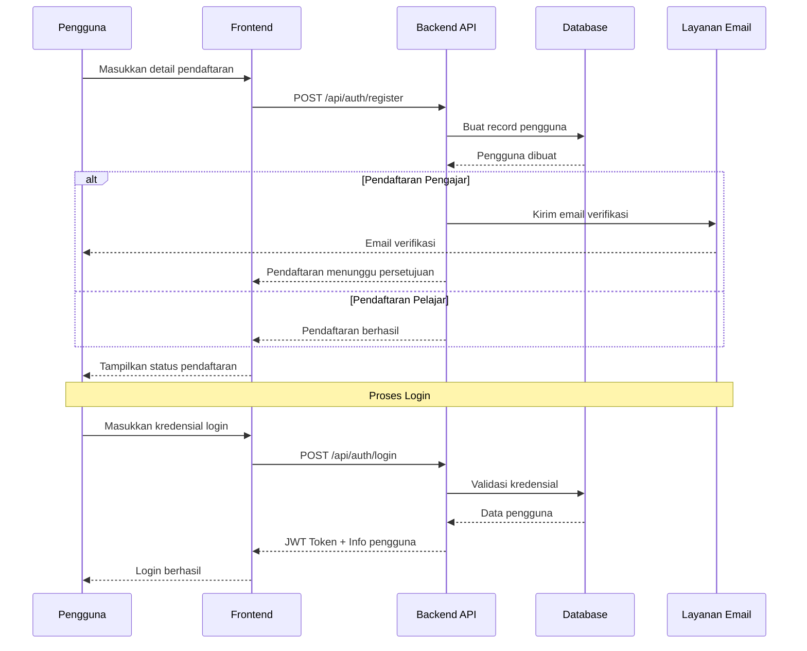
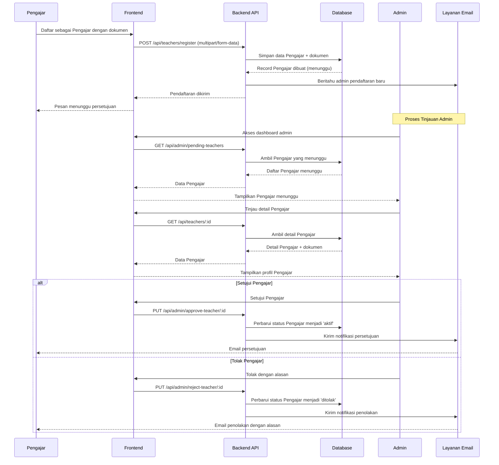
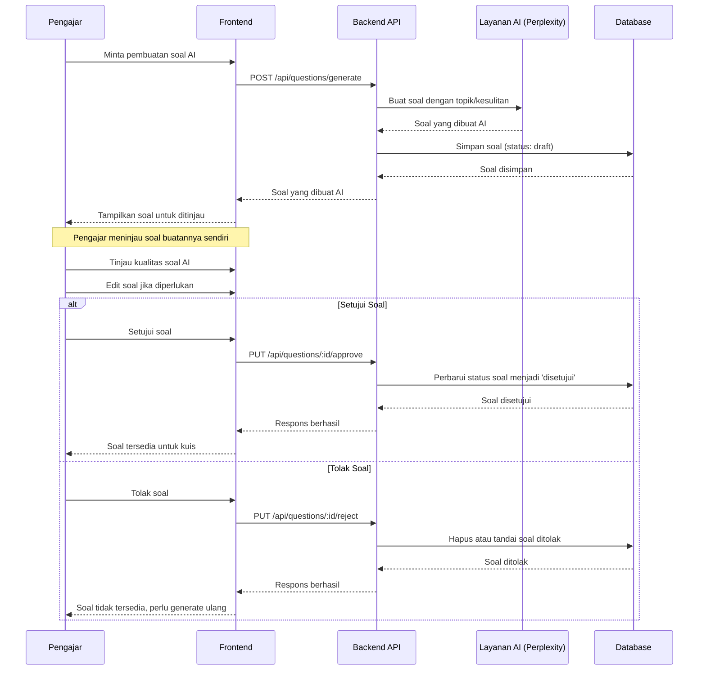
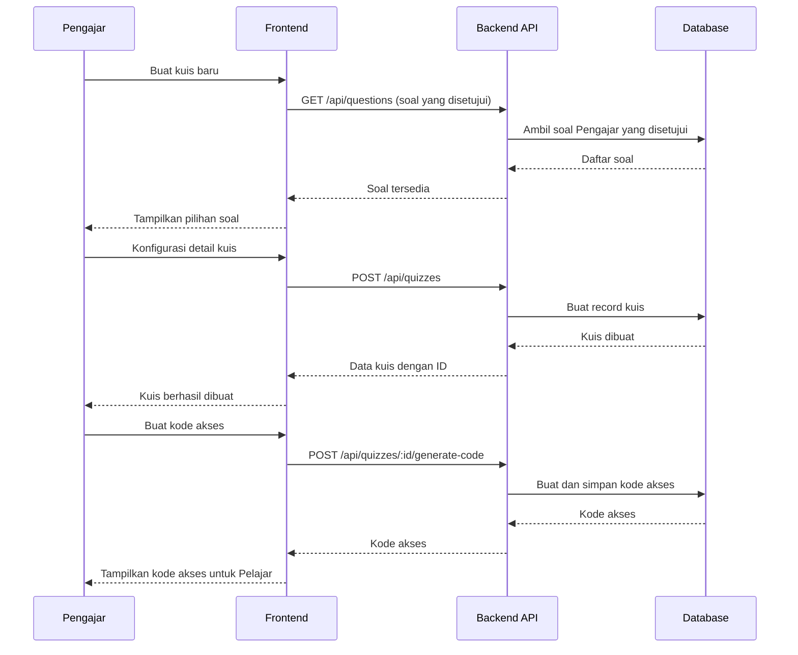
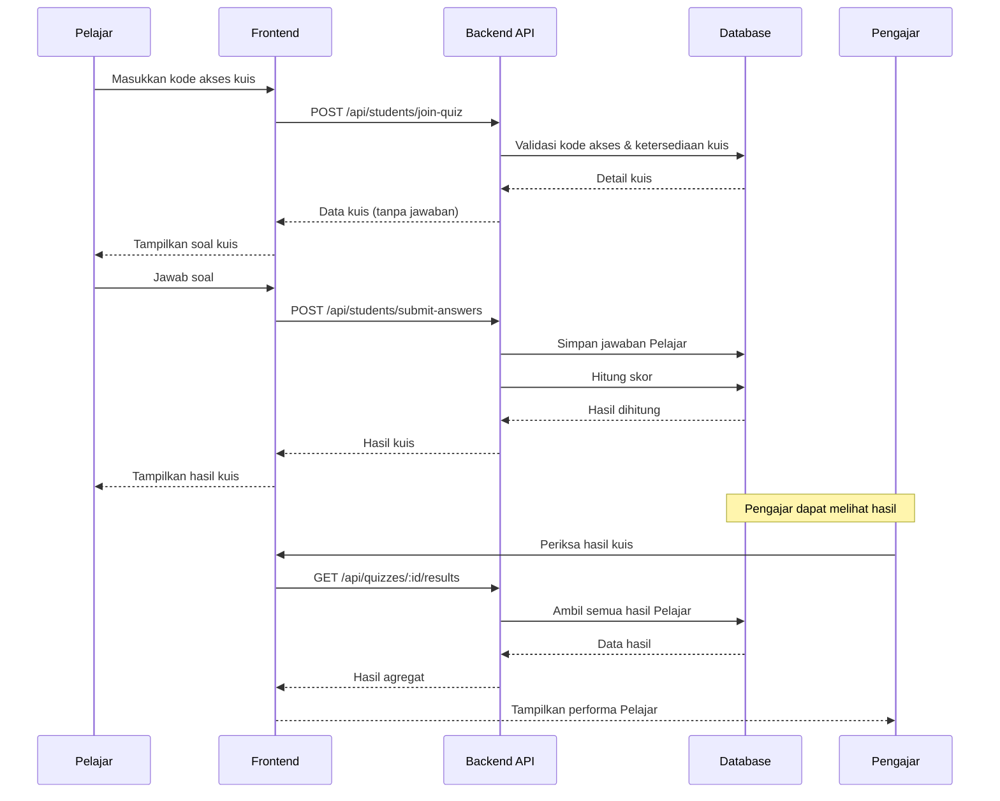
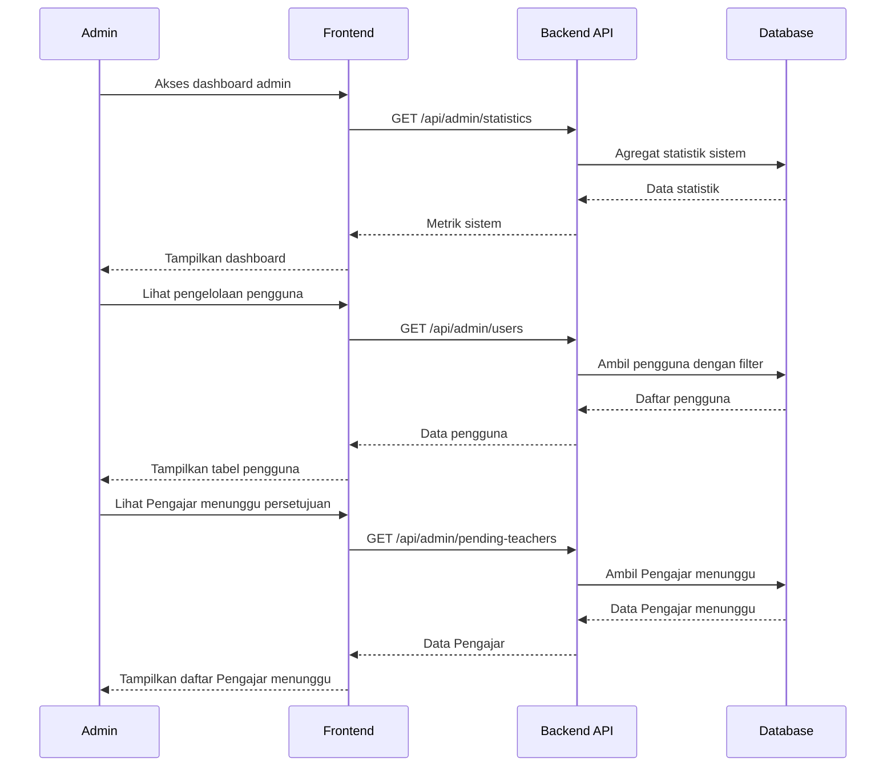

# Diagram Sequence - ExamExpert-AI

## 1. Alur Autentikasi Pengguna

## 2. Proses Persetujuan Pengajar

## 3. Proses Pembuatan dan Tinjauan Soal

## 4. Pembuatan dan Pengelolaan Kuis

## 5. Proses Pelajar Mengerjakan Kuis

## 6. Dashboard Admin dan Statistik

