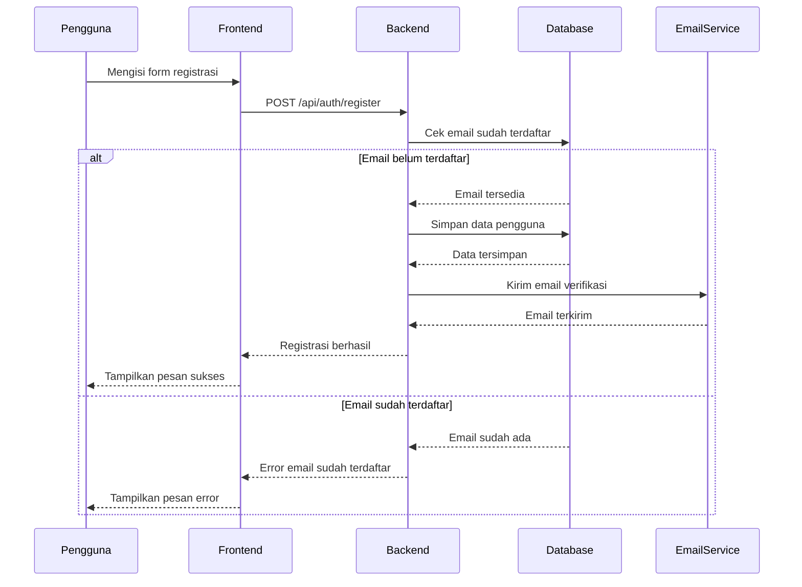
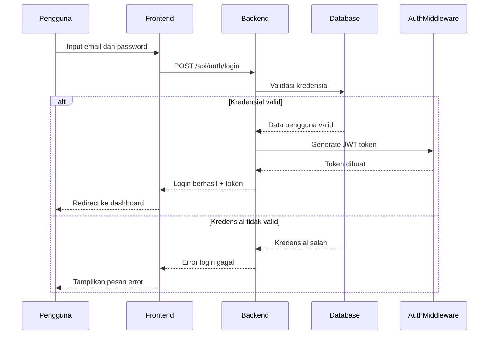
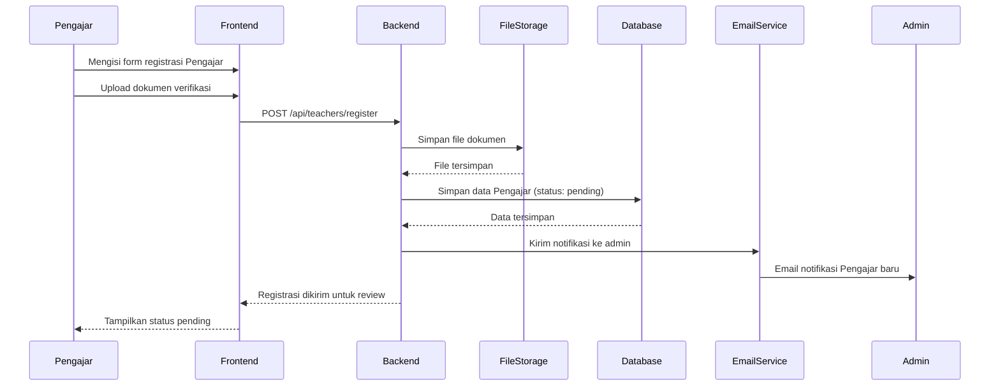
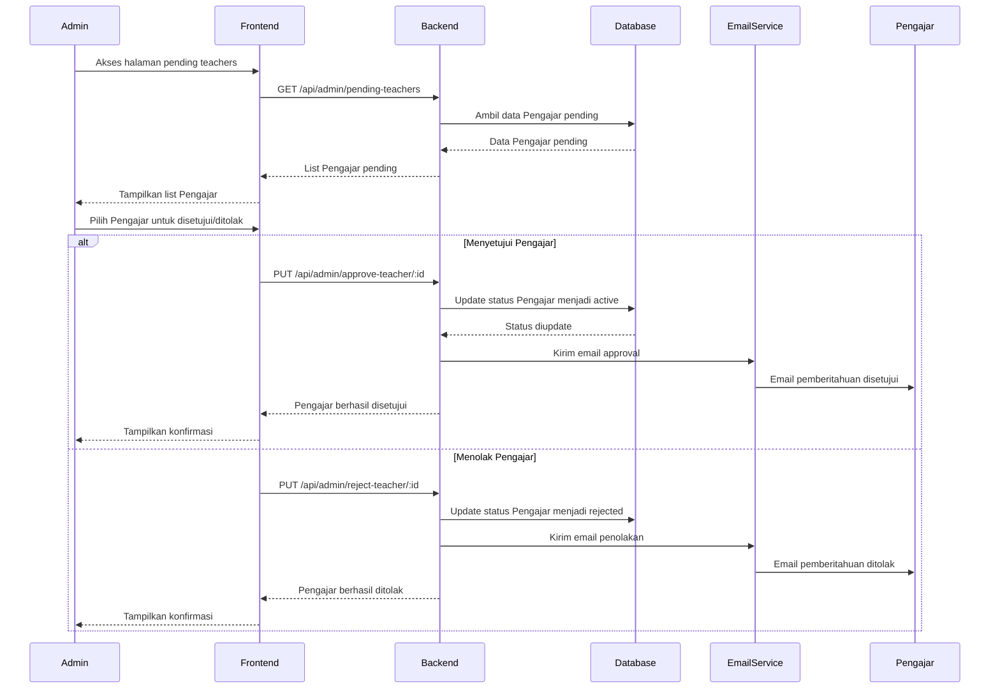
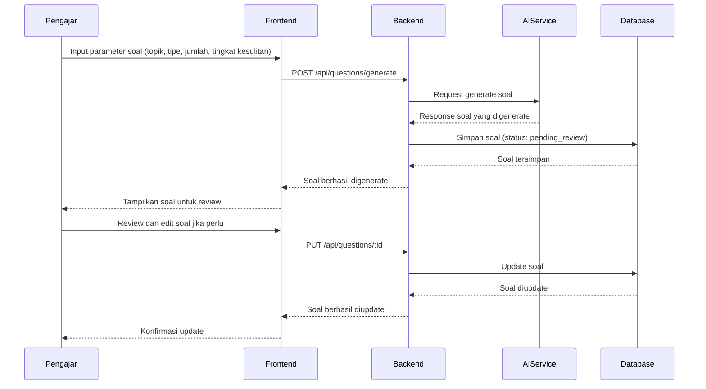
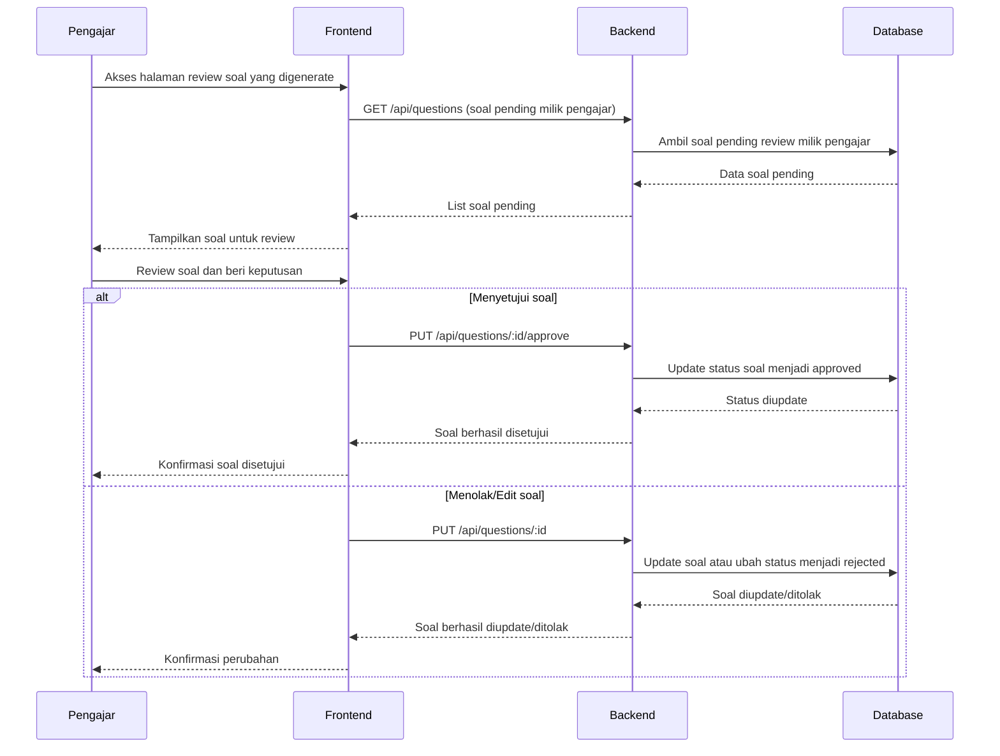
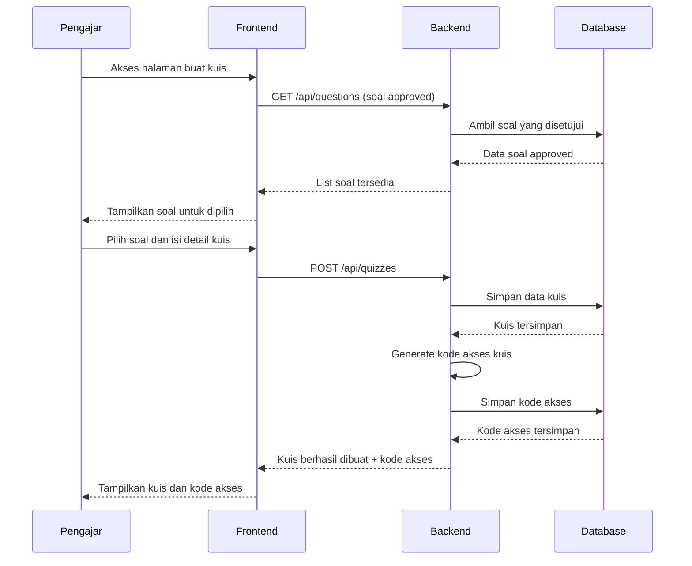
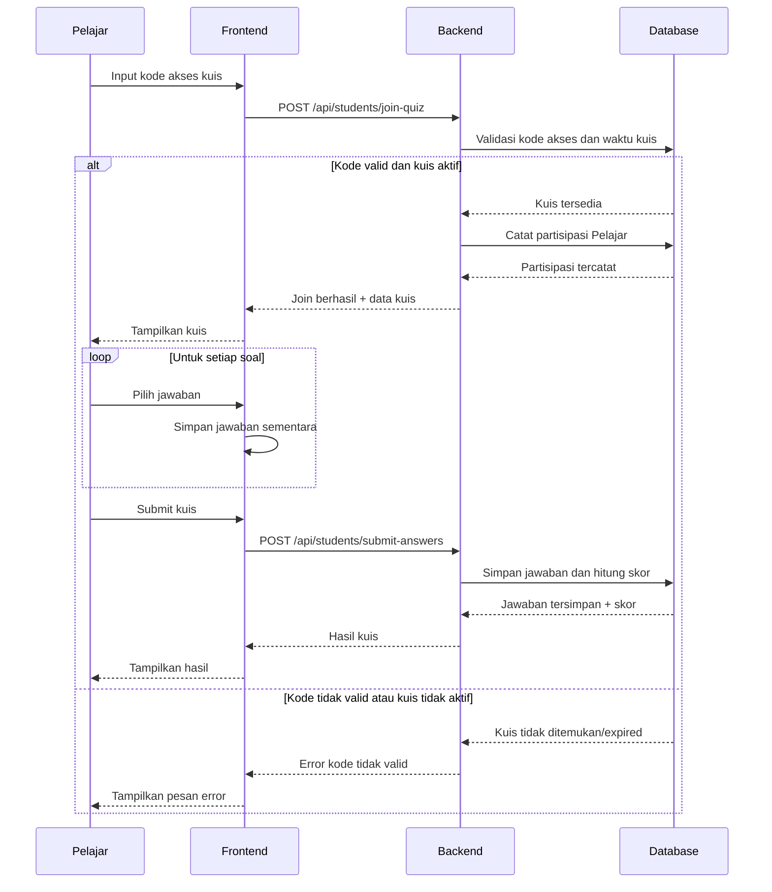
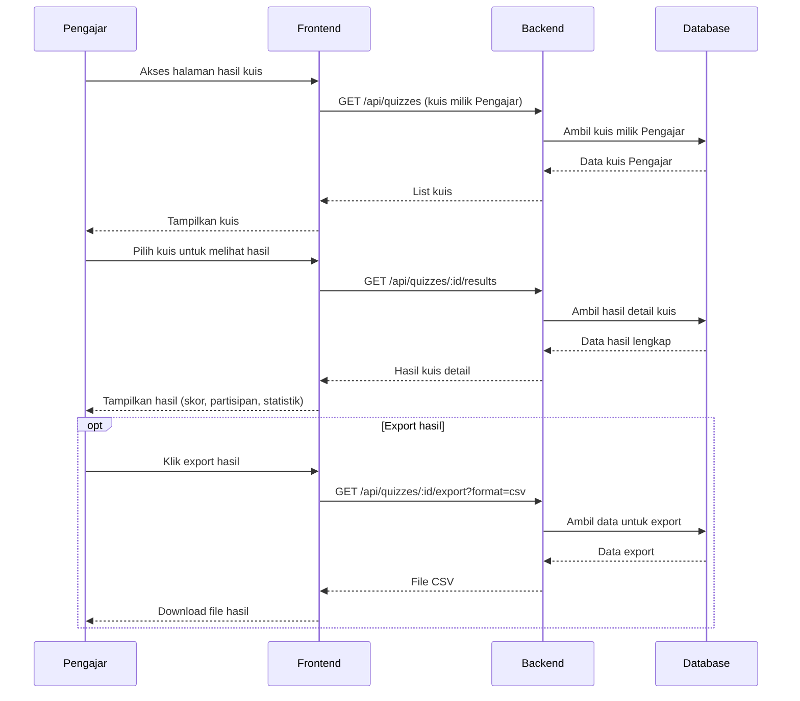
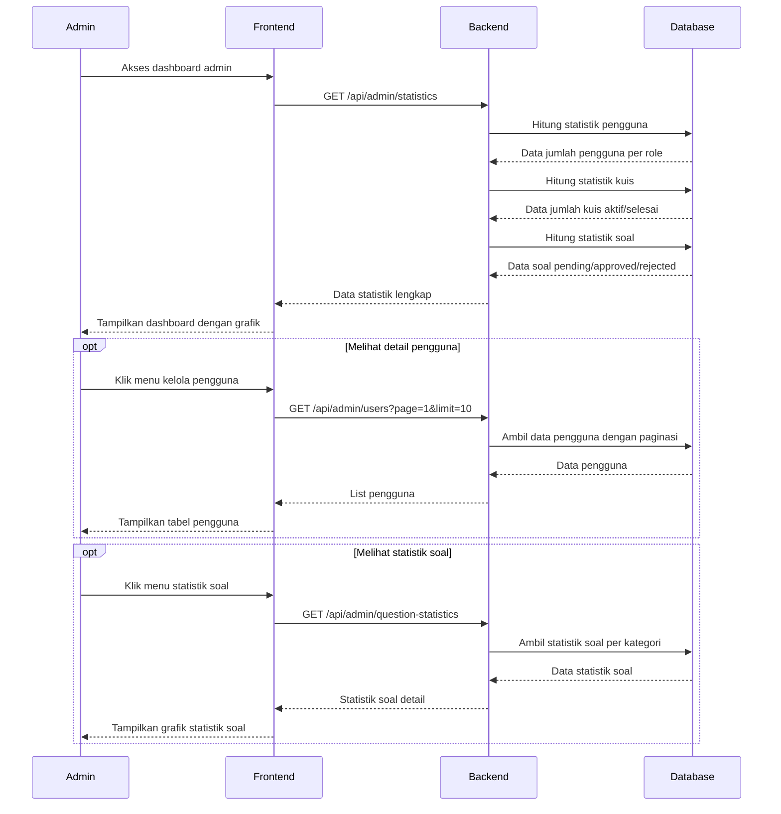

# Sequence Diagram Sistem ExamExpert-AI

## 1. Sequence Diagram - Registrasi Pengguna

## 2. Sequence Diagram - Login Pengguna

## 3. Sequence Diagram - Registrasi Pengajar

## 4. Sequence Diagram - Persetujuan Pengajar oleh Admin

## 5. Sequence Diagram - Generate Soal AI

## 6. Sequence Diagram - Persetujuan Soal oleh Pengajar

## 7. Sequence Diagram - Pembuatan Kuis

## 8. Sequence Diagram - Pelajar Mengikuti Kuis

## 9. Sequence Diagram - Melihat Hasil Kuis (Pengajar)

## 10. Sequence Diagram - Dashboard Admin & Statistik

---

**Keterangan Diagram:**
- Setiap sequence diagram menggambarkan interaksi antar komponen sistem
- Diagram menggunakan notasi standar UML sequence diagram
- Semua diagram dalam bahasa Indonesia sesuai permintaan
- Diagram mencakup flow utama dan alternatif flow (error handling)
- Menunjukkan komunikasi antara Frontend, Backend, Database, dan service eksternal
