# Diagram Sequence - ExamExpert-AI

## Daftar Isi
1. [Alur Autentikasi Pengguna](#1-alur-autentikasi-pengguna)
2. [Proses Persetujuan Guru](#2-proses-persetujuan-guru)
3. [Proses Pembuatan dan Tinjauan Soal](#3-proses-pembuatan-dan-tinjauan-soal)
4. [Pembuatan dan Pengelolaan Kuis](#4-pembuatan-dan-pengelolaan-kuis)
5. [Proses Siswa Mengerjakan Kuis](#5-proses-siswa-mengerjakan-kuis)
6. [Dashboard Admin dan Statistik](#6-dashboard-admin-dan-statistik)
7. [Sequence Diagram: Proses Registrasi Siswa vs Guru](#7-sequence-diagram-proses-registrasi-siswa-vs-guru)
8. [Sequence Diagram: Detail Upload Dokumen Guru](#8-sequence-diagram-detail-upload-dokumen-guru)
9. [Sequence Diagram: Notifikasi dan Status Update](#9-sequence-diagram-notifikasi-dan-status-update)

---

## 1. Alur Autentikasi Pengguna


## 2. Proses Persetujuan Guru


## 3. Proses Pembuatan dan Tinjauan Soal


## 4. Pembuatan dan Pengelolaan Kuis


## 5. Proses Siswa Mengerjakan Kuis


## 6. Dashboard Admin dan Statistik


## 7. Sequence Diagram: Proses Registrasi Siswa vs Guru

```mermaid
sequenceDiagram
    participant S as 👨‍🎓 Siswa
    participant T as 👨‍🏫 Guru
    participant F as Frontend
    participant API as Backend API
    participant DB as Database
    participant FS as File Storage
    participant A as 👨‍💼 Admin
    participant Email as 📧 Email Service

    Note over S,Email: 🎓 ALUR REGISTRASI SISWA (SEDERHANA)
    
    S->>F: Klik "Daftar sebagai Siswa"
    F->>S: Tampilkan form sederhana
    S->>F: Isi data: nama, email, password
    F->>F: Validasi client-side
    F->>API: POST /api/auth/register/student
    
    API->>API: Validasi server-side
    API->>DB: INSERT user (role: student, status: active)
    DB-->>API: User created successfully
    
    API->>Email: Kirim email selamat datang
    Email-->>S: Email: "Selamat datang di ExamExpert-AI"
    
    API-->>F: Response: {success: true, user: {...}}
    F->>F: Auto-login dengan token
    F-->>S: Redirect ke dashboard siswa
    
    Note over S: ✅ Siswa langsung dapat mengikuti kuis

    Note over T,Email: 👨‍🏫 ALUR REGISTRASI GURU (KOMPLEKS)
    
    T->>F: Klik "Daftar sebagai Guru"
    F->>T: Tampilkan form lengkap + upload
    T->>F: Isi data pribadi
    T->>F: Isi data institusi
    T->>F: Upload ijazah S1/S2
    F->>FS: Upload file 1
    FS-->>F: File URL 1
    T->>F: Upload sertifikat pendidik
    F->>FS: Upload file 2
    FS-->>F: File URL 2
    T->>F: Upload surat rekomendasi
    F->>FS: Upload file 3
    FS-->>F: File URL 3
    T->>F: Upload KTP/identitas
    F->>FS: Upload file 4
    FS-->>F: File URL 4
    
    F->>F: Validasi kelengkapan dokumen
    F->>API: POST /api/auth/register/teacher (multipart)
    
    API->>API: Validasi semua data & file
    API->>DB: INSERT user (role: teacher, status: pending)
    API->>DB: INSERT documents dengan file URLs
    DB-->>API: Teacher registration saved
    
    API->>Email: Kirim notifikasi ke admin
    Email-->>A: Email: "Pendaftaran guru baru menunggu review"
    
    API->>Email: Kirim konfirmasi ke guru
    Email-->>T: Email: "Pendaftaran diterima, menunggu review"
    
    API-->>F: Response: {success: true, status: "pending"}
    F-->>T: Tampilkan "Menunggu review admin"
    
    Note over T: ⏳ Guru menunggu approval admin

    Note over A,Email: 👨‍💼 PROSES REVIEW ADMIN
    
    A->>F: Login ke admin dashboard
    F->>API: GET /api/admin/pending-teachers
    API->>DB: SELECT teachers WHERE status = 'pending'
    DB-->>API: List pending teachers
    API-->>F: Teachers data
    F-->>A: Tampilkan daftar guru menunggu
    
    A->>F: Klik review guru tertentu
    F->>API: GET /api/admin/teacher/:id/details
    API->>DB: SELECT teacher + documents
    DB-->>API: Teacher details + file URLs
    API-->>F: Full teacher data
    F-->>A: Tampilkan detail + dokumen
    
    A->>F: Download/preview dokumen
    F->>FS: GET document files
    FS-->>A: Document files
    
    alt Admin Menyetujui
        A->>F: Klik "Setujui"
        F->>API: PUT /api/admin/approve-teacher/:id
        API->>DB: UPDATE teacher status = 'approved'
        DB-->>API: Status updated
        API->>Email: Kirim email persetujuan
        Email-->>T: Email: "Akun guru disetujui!"
        API-->>F: Success response
        F-->>A: Tampilkan "Guru disetujui"
        
        Note over T: ✅ Guru dapat akses fitur lengkap
        
    else Admin Menolak
        A->>F: Klik "Tolak" + isi alasan
        F->>API: PUT /api/admin/reject-teacher/:id
        API->>DB: UPDATE teacher status = 'rejected'
        DB-->>API: Status updated
        API->>Email: Kirim email penolakan + alasan
        Email-->>T: Email: "Pendaftaran ditolak: [alasan]"
        API-->>F: Success response
        F-->>A: Tampilkan "Guru ditolak"
        
        Note over T: ❌ Guru dapat mendaftar ulang
    end
```



## 8. Sequence Diagram: Detail Upload Dokumen Guru

```mermaid
sequenceDiagram
    participant T as 👨‍🏫 Guru
    participant F as Frontend
    participant API as Backend API
    participant FS as File Storage
    participant DB as Database

    Note over T,DB: 📄 PROSES UPLOAD DOKUMEN STEP-BY-STEP

    T->>F: Pilih file ijazah
    F->>F: Validasi file (format, size)
    
    alt File Valid
        F->>API: POST /api/upload/document
        Note right of API: Headers: Content-Type: multipart/form-data
        API->>API: Validasi file server-side
        API->>FS: Simpan file dengan nama unik
        FS-->>API: File path + URL
        API->>DB: INSERT temporary_uploads
        DB-->>API: Upload record created
        API-->>F: {fileId, url, status: "uploaded"}
        F->>F: Tampilkan preview + checkmark
        F-->>T: "✅ Ijazah berhasil diupload"
    else File Invalid
        F-->>T: "❌ Error: [format/size tidak valid]"
    end

    T->>F: Pilih file sertifikat
    F->>F: Validasi file
    F->>API: POST /api/upload/document
    API->>FS: Simpan file
    FS-->>API: File URL
    API->>DB: INSERT temporary_uploads
    API-->>F: Upload success
    F-->>T: "✅ Sertifikat berhasil diupload"

    T->>F: Pilih file rekomendasi
    F->>F: Validasi file
    F->>API: POST /api/upload/document
    API->>FS: Simpan file
    API->>DB: INSERT temporary_uploads
    API-->>F: Upload success
    F-->>T: "✅ Rekomendasi berhasil diupload"

    T->>F: Pilih file KTP
    F->>F: Validasi file
    F->>API: POST /api/upload/document
    API->>FS: Simpan file
    API->>DB: INSERT temporary_uploads
    API-->>F: Upload success
    F-->>T: "✅ KTP berhasil diupload"

    Note over T,DB: 📋 FINALISASI REGISTRASI

    F->>F: Cek kelengkapan (4 dokumen)
    F->>F: Enable tombol "Submit Registrasi"
    T->>F: Klik "Submit Registrasi"
    
    F->>API: POST /api/auth/register/teacher/finalize
    Note right of API: Body: {personalData, institutionData, documentIds: [...]}
    
    API->>DB: BEGIN TRANSACTION
    API->>DB: INSERT users (teacher)
    API->>DB: INSERT teacher_profiles
    API->>DB: UPDATE temporary_uploads → permanent
    API->>DB: INSERT teacher_documents
    API->>DB: COMMIT TRANSACTION
    
    DB-->>API: Registration complete
    API-->>F: {success: true, status: "pending_review"}
    F-->>T: "Registrasi berhasil! Menunggu review admin."

    Note over T: ⏳ Status: Menunggu review (1-3 hari kerja)
```



## 9. Sequence Diagram: Notifikasi dan Status Update

```mermaid
sequenceDiagram
    participant T as 👨‍🏫 Guru
    participant F as Frontend
    participant API as Backend API
    participant DB as Database
    participant Email as 📧 Email Service
    participant A as 👨‍💼 Admin

    Note over T,A: 📧 SISTEM NOTIFIKASI REGISTRASI

    Note over T,Email: Setelah Submit Registrasi Guru
    API->>Email: Trigger email ke admin
    Email->>Email: Generate email template
    Email-->>A: "📩 Pendaftaran guru baru: [Nama Guru]"
    
    API->>Email: Trigger email ke guru
    Email->>Email: Generate konfirmasi template
    Email-->>T: "📩 Registrasi diterima, menunggu review"

    Note over T,A: Guru Cek Status Berkala
    T->>F: Login & cek status
    F->>API: GET /api/auth/me
    API->>DB: SELECT user status
    DB-->>API: User data dengan status
    API-->>F: {status: "pending_review"}
    F-->>T: Tampilkan "Status: Menunggu Review"

    Note over A,Email: Admin Proses Review
    A->>F: Buka admin dashboard
    A->>F: Lihat notifikasi badge "3 guru menunggu"
    A->>F: Klik review guru
    
    alt Admin Approve
        A->>API: PUT /api/admin/approve-teacher/:id
        API->>DB: UPDATE status = 'approved'
        API->>Email: Trigger approval email
        Email-->>T: "🎉 Akun disetujui! Silakan login"
        
        Note over T: Real-time Status Update
        T->>F: Cek status (atau auto-refresh)
        F->>API: GET /api/auth/me
        API-->>F: {status: "approved"}
        F-->>T: "✅ Akun Aktif! Akses fitur guru tersedia"
        
    else Admin Reject
        A->>API: PUT /api/admin/reject-teacher/:id
        Note right of API: Body: {reason: "Dokumen tidak lengkap"}
        API->>DB: UPDATE status = 'rejected'
        API->>Email: Trigger rejection email
        Email-->>T: "❌ Pendaftaran ditolak: [Alasan]"
        
        T->>F: Cek status
        F->>API: GET /api/auth/me
        API-->>F: {status: "rejected", reason: "..."}
