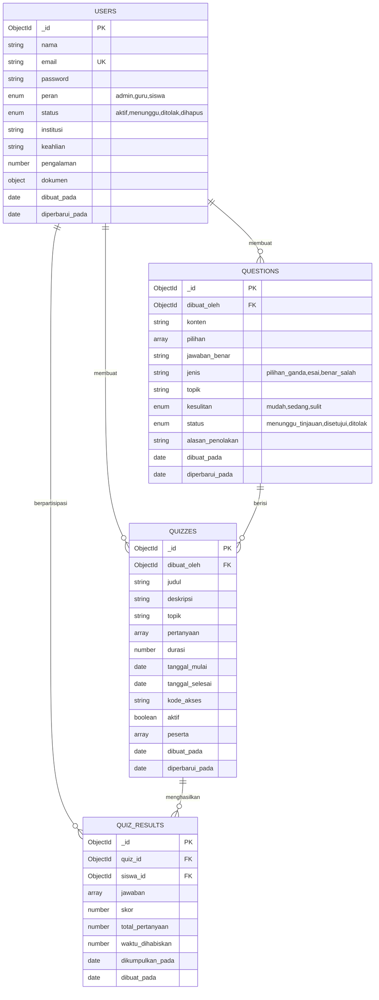
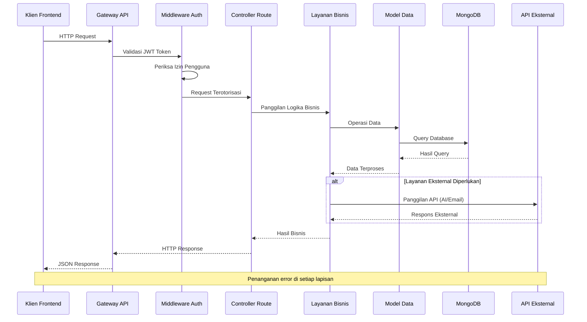

# Diagram Arsitektur Sistem - ExamExpert-AI

```mermaid
graph TB
    %% Lapisan Frontend
    subgraph "Lapisan Frontend"
        WebApp[Aplikasi Web React]
        
        subgraph "Komponen React"
            Auth[Halaman Autentikasi]
            AdminUI[Dashboard Admin]
            TeacherUI[Dashboard Guru]
            StudentUI[Dashboard Siswa]
            QuizUI[Interface Kuis]
        end
    end

    %% API Gateway / Backend
    subgraph "Lapisan API Backend"
        API[Server API Express.js]
        
        subgraph "Route API"
            AuthRoutes[Route Autentikasi]
            AdminRoutes[Route Admin]
            TeacherRoutes[Route Guru]
            StudentRoutes[Route Siswa]
            QuizRoutes[Route Kuis]
            QuestionRoutes[Route Soal]
        end
        
        subgraph "Middleware"
            AuthMW[Middleware Autentikasi]
            ValidationMW[Middleware Validasi]
            ErrorMW[Middleware Penanganan Error]
            UploadMW[Middleware Upload File]
        end
    end

    %% Lapisan Logika Bisnis
    subgraph "Lapisan Logika Bisnis"
        subgraph "Controller"
            AuthCtrl[Controller Auth]
            AdminCtrl[Controller Admin]
            TeacherCtrl[Controller Guru]
            StudentCtrl[Controller Siswa]
            QuizCtrl[Controller Kuis]
            QuestionCtrl[Controller Soal]
        end
        
        subgraph "Services"
            AIService[Generator Soal AI]
            EmailService[Layanan Email]
            FileService[Layanan Upload File]
            ValidationService[Layanan Validasi]
        end
    end

    %% Lapisan Data
    subgraph "Lapisan Data"
        Database[(Database MongoDB)]
        
        subgraph "Koleksi"
            Users[Koleksi Users]
            Questions[Koleksi Questions]
            Quizzes[Koleksi Quizzes]
            Results[Koleksi Quiz Results]
        end
        
        FileStorage[Sistem Penyimpanan File]
        
        subgraph "Model"
            UserModel[Model User]
            QuestionModel[Model Question]
            QuizModel[Model Quiz]
        end
    end

    %% Layanan Eksternal
    subgraph "Layanan Eksternal"
        PerplexityAI[API Perplexity AI]
        EmailProvider[Penyedia Layanan Email]
        CloudStorage[Penyimpanan File Cloud]
    end

    %% Lapisan Keamanan
    subgraph "Keamanan & Infrastruktur"
        JWT[Autentikasi JWT]
        CORS[Kebijakan CORS]
        RateLimit[Pembatasan Rate]
        SSL[Enkripsi SSL/TLS]
    end

    %% Koneksi
    WebApp --> API
    Auth --> AuthRoutes
    AdminUI --> AdminRoutes
    TeacherUI --> TeacherRoutes
    StudentUI --> StudentRoutes
    QuizUI --> QuizRoutes

    AuthRoutes --> AuthCtrl
    AdminRoutes --> AdminCtrl
    TeacherRoutes --> TeacherCtrl
    StudentRoutes --> StudentCtrl
    QuizRoutes --> QuizCtrl
    QuestionRoutes --> QuestionCtrl

    AuthCtrl --> UserModel
    AdminCtrl --> UserModel
    TeacherCtrl --> UserModel
    StudentCtrl --> QuizModel
    QuizCtrl --> QuizModel
    QuestionCtrl --> QuestionModel

    UserModel --> Users
    QuestionModel --> Questions
    QuizModel --> Quizzes

    AIService --> PerplexityAI
    EmailService --> EmailProvider
    FileService --> CloudStorage
    FileService --> FileStorage

    API --> AuthMW
    API --> ValidationMW
    API --> ErrorMW
    API --> UploadMW

    AuthMW --> JWT
    API --> CORS
    API --> RateLimit
    API --> SSL

    %% Styling
    classDef frontend fill:#e3f2fd
    classDef backend fill:#f3e5f5
    classDef database fill:#e8f5e8
    classDef external fill:#fff3e0
    classDef security fill:#ffebee

    class WebApp,Auth,AdminUI,TeacherUI,StudentUI,QuizUI frontend
    class API,AuthRoutes,AdminRoutes,TeacherRoutes,StudentRoutes,QuizRoutes,QuestionRoutes,AuthMW,ValidationMW,ErrorMW,UploadMW backend
    class Database,Users,Questions,Quizzes,Results,FileStorage,UserModel,QuestionModel,QuizModel database
    class PerplexityAI,EmailProvider,CloudStorage external
    class JWT,CORS,RateLimit,SSL security
```

## Relasi Skema Database

```mermaid
erDiagram
    USERS {
        ObjectId _id PK
        string nama
        string email UK
        string password
        enum peran "admin,guru,siswa"
        enum status "aktif,menunggu,ditolak,dihapus"
        string institusi
        string keahlian
        number pengalaman
        object dokumen
        date dibuat_pada
        date diperbarui_pada
    }

    QUESTIONS {
        ObjectId _id PK
        ObjectId dibuat_oleh FK
        string konten
        array pilihan
        string jawaban_benar
        string jenis "pilihan_ganda,esai,benar_salah"
        string topik
        enum kesulitan "mudah,sedang,sulit"
        enum status "menunggu_tinjauan,disetujui,ditolak"
        string alasan_penolakan
        date dibuat_pada
        date diperbarui_pada
    }

    QUIZZES {
        ObjectId _id PK
        ObjectId dibuat_oleh FK
        string judul
        string deskripsi
        string topik
        array pertanyaan
        number durasi
        date tanggal_mulai
        date tanggal_selesai
        string kode_akses
        boolean aktif
        array peserta
        date dibuat_pada
        date diperbarui_pada
    }

    QUIZ_RESULTS {
        ObjectId _id PK
        ObjectId quiz_id FK
        ObjectId siswa_id FK
        array jawaban
        number skor
        number total_pertanyaan
        number waktu_dihabiskan
        date dikumpulkan_pada
        date dibuat_pada
    }

    USERS ||--o{ QUESTIONS : membuat
    USERS ||--o{ QUIZZES : membuat
    USERS ||--o{ QUIZ_RESULTS : berpartisipasi
    QUIZZES ||--o{ QUIZ_RESULTS : menghasilkan
    QUESTIONS ||--o{ QUIZZES : berisi
```

## Arsitektur Alur API

```mermaid
sequenceDiagram
    participant Client as Klien Frontend
    participant Gateway as Gateway API
    participant Auth as Middleware Auth
    participant Controller as Controller Route
    participant Service as Layanan Bisnis
    participant Model as Model Data
    participant DB as MongoDB
    participant External as API Eksternal

    Client->>Gateway: HTTP Request
    Gateway->>Auth: Validasi JWT Token
    Auth->>Auth: Periksa Izin Pengguna
    Auth->>Controller: Request Terotorisasi
    
    Controller->>Service: Panggilan Logika Bisnis
    Service->>Model: Operasi Data
    Model->>DB: Query Database
    DB-->>Model: Hasil Query
    Model-->>Service: Data Terproses
    
    alt Layanan Eksternal Diperlukan
        Service->>External: Panggilan API (AI/Email)
        External-->>Service: Respons Eksternal
    end
    
    Service-->>Controller: Hasil Bisnis
    Controller-->>Gateway: HTTP Response
    Gateway-->>Client: JSON Response

    Note over Client,External: Penanganan error di setiap lapisan
```
