# Diagram Use Case - ExamExpert-AI

## 1. Use Case Sistem Keseluruhan

```mermaid
graph TD
    %% Aktor
    Student[👨‍🎓 Siswa]
    Teacher[👨‍🏫 Guru]
    Admin[👨‍💼 Admin]
    AIService[🤖 Layanan AI]
    EmailService[📧 Layanan Email]

    %% Use Case Siswa
    subgraph "Use Case Siswa"
        UC1[Daftar sebagai Siswa]
        UC2[Masuk ke Sistem]
        UC3[Bergabung Kuis dengan Kode Akses]
        UC4[Mengerjakan Kuis]
        UC5[Kirim Jawaban Kuis]
        UC6[Lihat Hasil Kuis]
        UC7[Lihat Riwayat Kuis]
        UC8[Lihat Kuis yang Tersedia]
        UC9[Perbarui Profil]
    end

    %% Use Case Guru
    subgraph "Use Case Guru"
        UC10[Daftar sebagai Guru]
        UC11[Unggah Dokumen]
        UC12[Cek Status Pendaftaran]
        UC13[Buat Soal dengan AI]
        UC14[Tinjau Soal yang Dibuat]
        UC15[Buat Kuis]
        UC16[Kelola Pengaturan Kuis]
        UC17[Buat Kode Akses]
        UC18[Lihat Hasil Kuis]
        UC19[Ekspor Hasil Kuis]
        UC20[Kelola Soal]
        UC21[Nonaktifkan Kuis]
    end

    %% Use Case Admin
    subgraph "Use Case Admin"
        UC22[Tinjau Pendaftaran Guru]
        UC23[Setujui/Tolak Guru]
        UC24[Kelola Pengguna]
        UC25[Lihat Statistik Sistem]
        UC26[Tinjau Soal]
        UC27[Setujui/Tolak Soal]
        UC28[Buat Laporan]
        UC29[Hapus Pengguna]
        UC30[Lihat Statistik Soal]
    end

    %% Autentikasi & Umum
    subgraph "Use Case Umum"
        UC31[Ganti Kata Sandi]
        UC32[Perbarui Profil]
        UC33[Keluar]
        UC34[Reset Kata Sandi]
    end

    %% Hubungan
    Student --> UC1
    Student --> UC2
    Student --> UC3
    Student --> UC4
    Student --> UC5
    Student --> UC6
    Student --> UC7
    Student --> UC8
    Student --> UC9
    Student --> UC31
    Student --> UC32
    Student --> UC33

    Teacher --> UC10
    Teacher --> UC11
    Teacher --> UC12
    Teacher --> UC13
    Teacher --> UC14
    Teacher --> UC15
    Teacher --> UC16
    Teacher --> UC17
    Teacher --> UC18
    Teacher --> UC19
    Teacher --> UC20
    Teacher --> UC21
    Teacher --> UC2
    Teacher --> UC31
    Teacher --> UC32
    Teacher --> UC33

    Admin --> UC22
    Admin --> UC23
    Admin --> UC24
    Admin --> UC25
    Admin --> UC26
    Admin --> UC27
    Admin --> UC28
    Admin --> UC29
    Admin --> UC30
    Admin --> UC2
    Admin --> UC31
    Admin --> UC32
    Admin --> UC33

    %% Interaksi Sistem Eksternal
    UC13 -.->|menggunakan| AIService
    UC23 -.->|memicu| EmailService
    UC27 -.->|memicu| EmailService
    UC34 -.->|menggunakan| EmailService

    %% Hubungan Include/Extend
    UC4 -.->|termasuk| UC2
    UC5 -.->|memperluas| UC4
    UC15 -.->|termasuk| UC14
    UC23 -.->|termasuk| UC22
```

## 2. Use Case Pengelolaan Guru

## 3. Use Case Pengelolaan Soal

```mermaid
graph TD
    %% Aktor
    Teacher[👨‍🏫 Guru]
    Admin[👨‍💼 Admin]
    AI[🤖 Layanan AI]

    %% Pembuatan Soal
    subgraph "Pembuatan Soal"
        QG1[Tentukan Topik]
        QG2[Atur Tingkat Kesulitan]
        QG3[Pilih Jenis Soal]
        QG4[Atur Jumlah Soal]
        QG5[Buat Soal]
        QG6[Tinjau Soal yang Dibuat]
        QG7[Edit Soal]
        QG8[Kirim untuk Persetujuan]
    end

    %% Proses Tinjauan Soal
    subgraph "Proses Tinjauan Soal"
        QR1[Lihat Soal Menunggu]
        QR2[Evaluasi Kualitas Soal]
        QR3[Periksa Keakuratan Jawaban]
        QR4[Setujui Soal]
        QR5[Tolak Soal]
        QR6[Berikan Masukan]
        QR7[Setujui Soal Massal]
    end

    %% Pengelolaan Soal
    subgraph "Pengelolaan Soal"
        QM1[Lihat Soal Saya]
        QM2[Cari Soal]
        QM3[Filter berdasarkan Topik/Kesulitan]
        QM4[Perbarui Soal]
        QM5[Hapus Soal]
        QM6[Lihat Statistik Soal]
    end

    %% Hubungan
    Teacher --> QG1
    Teacher --> QG2
    Teacher --> QG3
    Teacher --> QG4
    Teacher --> QG5
    Teacher --> QG6
    Teacher --> QG7
    Teacher --> QG8
    Teacher --> QM1
    Teacher --> QM2
    Teacher --> QM3
    Teacher --> QM4
    Teacher --> QM5

    Admin --> QR1
    Admin --> QR2
    Admin --> QR3
    Admin --> QR4
    Admin --> QR5
    Admin --> QR6
    Admin --> QR7
    Admin --> QM6

    QG5 -.-> AI
    QG8 --> QR1
```

## 4. Use Case Pengelolaan Kuis

```mermaid
graph TB
    %% Aktor
    Teacher[👨‍🏫 Guru]
    Student[👨‍🎓 Siswa]

    %% Pembuatan Kuis
    subgraph "Pembuatan & Pengaturan Kuis"
        QC1[Buat Kuis Baru]
        QC2[Atur Judul & Deskripsi Kuis]
        QC3[Pilih Soal]
        QC4[Atur Durasi Waktu]
        QC5[Konfigurasi Tanggal Mulai/Selesai]
        QC6[Buat Kode Akses]
        QC7[Publikasikan Kuis]
        QC8[Bagikan Kode Akses]
    end

    %% Mengerjakan Kuis
    subgraph "Proses Mengerjakan Kuis"
        QT1[Masukkan Kode Akses]
        QT2[Bergabung Sesi Kuis]
        QT3[Baca Instruksi]
        QT4[Jawab Soal]
        QT5[Kirim Jawaban]
        QT6[Lihat Hasil]
        QT7[Tinjau Jawaban Salah]
    end

    %% Pengelolaan Kuis
    subgraph "Pengelolaan Kuis"
        QM1[Lihat Semua Kuis]
        QM2[Edit Detail Kuis]
        QM3[Pantau Sesi Aktif]
        QM4[Lihat Daftar Peserta]
        QM5[Ekspor Hasil]
        QM6[Nonaktifkan Kuis]
        QM7[Buat Laporan]
        QM8[Analisis Performa]
    end

    %% Aktivitas Siswa
    subgraph "Aktivitas Siswa"
        SA1[Lihat Kuis Tersedia]
        SA2[Lihat Riwayat Kuis]
        SA3[Periksa Nilai]
        SA4[Unduh Sertifikat]
    end

    %% Hubungan
    Teacher --> QC1
    Teacher --> QC2
    Teacher --> QC3
    Teacher --> QC4
    Teacher --> QC5
    Teacher --> QC6
    Teacher --> QC7
    Teacher --> QC8
    Teacher --> QM1
    Teacher --> QM2
    Teacher --> QM3
    Teacher --> QM4
    Teacher --> QM5
    Teacher --> QM6
    Teacher --> QM7
    Teacher --> QM8

    Student --> QT1
    Student --> QT2
    Student --> QT3
    Student --> QT4
    Student --> QT5
    Student --> QT6
    Student --> QT7
    Student --> SA1
    Student --> SA2
    Student --> SA3
    Student --> SA4

    QC8 --> QT1
    QT5 --> QM4
```

## 5. Use Case Administratif

```mermaid
graph TD
    %% Aktor
    Admin[👨‍💼 Admin]
    System[🖥️ Sistem]

    %% Pengelolaan Pengguna
    subgraph "Pengelolaan Pengguna"
        UM1[Lihat Semua Pengguna]
        UM2[Filter Pengguna berdasarkan Peran]
        UM3[Cari Pengguna]
        UM4[Lihat Detail Pengguna]
        UM5[Edit Profil Pengguna]
        UM6[Ubah Status Pengguna]
        UM7[Hapus Akun Pengguna]
        UM8[Reset Kata Sandi Pengguna]
    end

    %% Statistik Sistem
    subgraph "Analitik Sistem"
        SA1[Lihat Dashboard]
        SA2[Buat Statistik Pengguna]
        SA3[Lihat Statistik Soal]
        SA4[Pantau Performa Sistem]
        SA5[Ekspor Laporan Analitik]
        SA6[Lihat Log Aktivitas]
        SA7[Lacak Tren Pendaftaran]
    end

    %% Pengelolaan Konten
    subgraph "Pengelolaan Konten"
        CM1[Tinjau Soal Menunggu]
        CM2[Setujui/Tolak Soal]
        CM3[Pantau Aktivitas Kuis]
        CM4[Tinjau Konten yang Dilaporkan]
        CM5[Kelola Pengaturan Sistem]
        CM6[Backup Data]
        CM7[Restore Data]
    end

    %% Pemeliharaan Sistem
    subgraph "Pemeliharaan Sistem"
        SM1[Perbarui Konfigurasi Sistem]
        SM2[Kelola Template Email]
        SM3[Pantau Kesehatan Server]
        SM4[Jadwalkan Pemeliharaan]
        SM5[Perbarui Pengaturan Keamanan]
        SM6[Kelola Kunci API]
    end

    %% Hubungan
    Admin --> UM1
    Admin --> UM2
    Admin --> UM3
    Admin --> UM4
    Admin --> UM5
    Admin --> UM6
    Admin --> UM7
    Admin --> UM8

    Admin --> SA1
    Admin --> SA2
    Admin --> SA3
    Admin --> SA4
    Admin --> SA5
    Admin --> SA6
    Admin --> SA7

    Admin --> CM1
    Admin --> CM2
    Admin --> CM3
    Admin --> CM4
    Admin --> CM5
    Admin --> CM6
    Admin --> CM7

    Admin --> SM1
    Admin --> SM2
    Admin --> SM3
    Admin --> SM4
    Admin --> SM5
    Admin --> SM6

    %% Interaksi sistem
    SA1 -.-> System
    SA4 -.-> System
    SM3 -.-> System
    CM6 -.-> System
    CM7 -.-> System
```

