# Diagram Use Case - ExamExpert-AI

## Daftar Isi
1. [Use Case Sistem Keseluruhan](#1-use-case-sistem-keseluruhan)
2. [Use Case Pendaftaran Pengguna](#2-use-case-pendaftaran-pengguna) 
3. [Use Case Manajemen Soal dan Kuis](#3-use-case-manajemen-soal-dan-kuis)
4. [Use Case Manajemen Pengguna (Admin)](#4-use-case-manajemen-pengguna-admin)
5. [Use Case Sistem dan Pemeliharaan](#5-use-case-sistem-dan-pemeliharaan)
6. [Use Case Proses Registrasi Pengguna](#6-use-case-proses-registrasi-pengguna)
7. [Use Case Detail: Proses Upload dan Verifikasi Dokumen Guru](#7-use-case-detail-proses-upload-dan-verifikasi-dokumen-guru)
8. [Use Case Ringkasan: Perbandingan Alur Registrasi](#8-use-case-ringkasan-perbandingan-alur-registrasi)

---

## 1. Use Case Sistem Keseluruhan

```mermaid
graph TD
    %% Aktor
    Student[👨‍🎓 Siswa]
    Teacher[👨‍🏫 Guru]
    Admin[👨‍💼 Admin]
    AIService[🤖 Layanan AI]
    EmailService[📧 Layanan Email]

    %% Use Case Siswa
    subgraph "Use Case Siswa"
        UC1[Daftar sebagai Siswa]
        UC2[Masuk ke Sistem]
        UC3[Bergabung Kuis dengan Kode Akses]
        UC4[Mengerjakan Kuis]
        UC5[Kirim Jawaban Kuis]
        UC6[Lihat Hasil Kuis]
        UC7[Lihat Riwayat Kuis]
        UC8[Lihat Kuis yang Tersedia]
        UC9[Perbarui Profil]
    end

    %% Use Case Guru
    subgraph "Use Case Guru"
        UC10[Daftar sebagai Guru]
        UC11[Unggah Dokumen]
        UC12[Cek Status Pendaftaran]
        UC13[Buat Soal dengan AI]
        UC14[Tinjau Soal yang Dibuat]
        UC26[Setujui/Tolak Soal Sendiri]
        UC15[Buat Kuis]
        UC16[Kelola Pengaturan Kuis]
        UC17[Buat Kode Akses]
        UC18[Lihat Hasil Kuis]
        UC19[Ekspor Hasil Kuis]
        UC20[Kelola Soal]
        UC21[Nonaktifkan Kuis]
        UC30[Lihat Statistik Soal]
    end

    %% Use Case Admin
    subgraph "Use Case Admin"
        UC22[Tinjau Pendaftaran Guru]
        UC23[Setujui/Tolak Guru]
        UC24[Kelola Pengguna]
        UC25[Lihat Statistik Sistem]
        UC28[Buat Laporan]
        UC29[Hapus Pengguna]
    end

    %% Autentikasi & Umum
    subgraph "Use Case Umum"
        UC31[Ganti Kata Sandi]
        UC32[Perbarui Profil]
        UC33[Keluar]
        UC34[Reset Kata Sandi]
    end

    %% Hubungan
    Student --> UC1
    Student --> UC2
    Student --> UC3
    Student --> UC4
    Student --> UC5
    Student --> UC6
    Student --> UC7
    Student --> UC8
    Student --> UC9
    Student --> UC31
    Student --> UC32
    Student --> UC33

    Teacher --> UC10
    Teacher --> UC11
    Teacher --> UC12
    Teacher --> UC13
    Teacher --> UC14
    Teacher --> UC26
    Teacher --> UC15
    Teacher --> UC16
    Teacher --> UC17
    Teacher --> UC18
    Teacher --> UC19
    Teacher --> UC20
    Teacher --> UC21
    Teacher --> UC30
    Teacher --> UC2
    Teacher --> UC31
    Teacher --> UC32
    Teacher --> UC33

    Admin --> UC22
    Admin --> UC23
    Admin --> UC24
    Admin --> UC25
    Admin --> UC28
    Admin --> UC29
    Admin --> UC2
    Admin --> UC31
    Admin --> UC32
    Admin --> UC33

    %% Interaksi Sistem Eksternal
    UC13 -.->|menggunakan| AIService
    UC23 -.->|memicu| EmailService
    UC26 -.->|memicu notifikasi| EmailService
    UC34 -.->|menggunakan| EmailService

    %% Hubungan Include/Extend
    UC4 -.->|termasuk| UC2
    UC5 -.->|memperluas| UC4
    UC15 -.->|termasuk| UC14
    UC23 -.->|termasuk| UC22
    UC26 -.->|termasuk| UC14
```



## 2. Use Case Pendaftaran Pengguna

```mermaid
graph LR
    %% Aktor
    Student[👨‍🎓 Siswa]
    Teacher[👨‍🏫 Guru Calon]
    Admin[👨‍💼 Admin]
    EmailSys[📧 Sistem Email]

    %% Pendaftaran Siswa (Sederhana)
    subgraph "Pendaftaran Siswa"
        SR1[Isi Formulir Pendaftaran]
        SR2[Masukkan Data Pribadi]
        SR3[Buat Akun]
        SR4[Langsung Aktif]
        SR5[Mulai Mengikuti Kuis]
    end

    %% Pendaftaran Guru (Kompleks)
    subgraph "Pendaftaran Guru"
        TR1[Isi Formulir Pendaftaran]
        TR2[Masukkan Data Pribadi]
        TR3[Masukkan Data Institusi]
        TR4[Unggah Sertifikat Gelar]
        TR5[Unggah Sertifikat Mengajar]
        TR6[Unggah Surat Rekomendasi]
        TR7[Kirim Pendaftaran]
        TR8[Menunggu Verifikasi Admin]
    end

    %% Proses Verifikasi Admin
    subgraph "Proses Verifikasi Admin"
        AR1[Tinjau Pendaftaran Guru]
        AR2[Verifikasi Dokumen]
        AR3[Periksa Kredensial]
        AR4[Setujui Pendaftaran]
        AR5[Tolak Pendaftaran]
        AR6[Berikan Alasan Penolakan]
    end

    %% Notifikasi Sistem
    subgraph "Notifikasi Sistem"
        SN1[Kirim Email Konfirmasi Siswa]
        SN2[Kirim Email Konfirmasi Guru]
        SN3[Kirim Email Persetujuan]
        SN4[Kirim Email Penolakan]
        SN5[Perbarui Status Akun]
    end

    %% Hubungan Siswa
    Student --> SR1
    Student --> SR2
    Student --> SR3
    SR3 --> SN1
    SN1 --> SR4
    SR4 --> SR5

    %% Hubungan Guru
    Teacher --> TR1
    Teacher --> TR2
    Teacher --> TR3
    Teacher --> TR4
    Teacher --> TR5
    Teacher --> TR6
    Teacher --> TR7
    TR7 --> SN2
    SN2 --> TR8

    %% Hubungan Admin
    Admin --> AR1
    Admin --> AR2
    Admin --> AR3
    Admin --> AR4
    Admin --> AR5
    Admin --> AR6

    %% Proses Verifikasi
    TR8 --> AR1
    AR4 --> SN3
    AR4 --> SN5
    AR5 --> SN4
    AR5 --> SN5

    %% Sistem Email
    SN1 -.-> EmailSys
    SN2 -.-> EmailSys
    SN3 -.-> EmailSys
    SN4 -.-> EmailSys
```

```mermaid
graph LR
    %% Aktor
    Teacher[👨‍🏫 Guru]
    Admin[👨‍💼 Admin]
    EmailSys[📧 Sistem Email]

    %% Proses Pendaftaran Guru
    subgraph "Pendaftaran Guru"
        TR1[Isi Formulir Pendaftaran]
        TR2[Unggah Sertifikat Gelar]
        TR3[Unggah Sertifikat Mengajar]
        TR4[Unggah Surat Rekomendasi]
        TR5[Kirim Pendaftaran]
        TR6[Cek Status Pendaftaran]
    end

    %% Proses Tinjauan Admin
    subgraph "Proses Tinjauan Admin"
        AR1[Lihat Pendaftaran Menunggu]
        AR2[Tinjau Dokumen Guru]
        AR3[Verifikasi Kredensial]
        AR4[Setujui Guru]
        AR5[Tolak Guru]
        AR6[Berikan Alasan Penolakan]
    end

    %% Proses Sistem
    subgraph "Notifikasi Sistem"
        SN1[Kirim Email Konfirmasi]
        SN2[Kirim Email Persetujuan]
        SN3[Kirim Email Penolakan]
        SN4[Perbarui Status Guru]
    end

    %% Hubungan
    Teacher --> TR1
    Teacher --> TR2
    Teacher --> TR3
    Teacher --> TR4
    Teacher --> TR5
    Teacher --> TR6

    Admin --> AR1
    Admin --> AR2
    Admin --> AR3
    Admin --> AR4
    Admin --> AR5
    Admin --> AR6

    TR5 --> SN1
    AR4 --> SN2
    AR4 --> SN4
    AR5 --> SN3
    AR5 --> SN4

    SN1 -.-> EmailSys
    SN2 -.-> EmailSys
    SN3 -.-> EmailSys
```





## 3. Use Case Pengelolaan Soal

```mermaid
graph TD
    %% Aktor
    Teacher[👨‍🏫 Guru]
    AI[🤖 Layanan AI]

    %% Pembuatan Soal
    subgraph "Pembuatan Soal"
        QG1[Tentukan Topik]
        QG2[Atur Tingkat Kesulitan]
        QG3[Pilih Jenis Soal]
        QG4[Atur Jumlah Soal]
        QG5[Buat Soal dengan AI]
        QG6[Tinjau Soal yang Dibuat AI]
        QG7[Edit Soal]
        QG8[Setujui/Tolak Soal Sendiri]
    end

    %% Pengelolaan Soal
    subgraph "Pengelolaan Soal"
        QM1[Lihat Soal Saya]
        QM2[Cari Soal]
        QM3[Filter berdasarkan Topik/Kesulitan]
        QM4[Perbarui Soal]
        QM5[Hapus Soal]
        QM6[Lihat Statistik Soal]
    end

    %% Hubungan
    Teacher --> QG1
    Teacher --> QG2
    Teacher --> QG3
    Teacher --> QG4
    Teacher --> QG5
    Teacher --> QG6
    Teacher --> QG7
    Teacher --> QG8
    Teacher --> QM1
    Teacher --> QM2
    Teacher --> QM3
    Teacher --> QM4
    Teacher --> QM5
    Teacher --> QM6

    QG5 -.-> AI
    QG6 --> QG8
```


```

## 4. Use Case Pengelolaan Kuis

```mermaid
graph TB
    %% Aktor
    Teacher[👨‍🏫 Guru]
    Student[👨‍🎓 Siswa]

    %% Pembuatan Kuis
    subgraph "Pembuatan & Pengaturan Kuis"
        QC1[Buat Kuis Baru]
        QC2[Atur Judul & Deskripsi Kuis]
        QC3[Pilih Soal]
        QC4[Atur Durasi Waktu]
        QC5[Konfigurasi Tanggal Mulai/Selesai]
        QC6[Buat Kode Akses]
        QC7[Publikasikan Kuis]
        QC8[Bagikan Kode Akses]
    end

    %% Mengerjakan Kuis
    subgraph "Proses Mengerjakan Kuis"
        QT1[Masukkan Kode Akses]
        QT2[Bergabung Sesi Kuis]
        QT3[Baca Instruksi]
        QT4[Jawab Soal]
        QT5[Kirim Jawaban]
        QT6[Lihat Hasil]
        QT7[Tinjau Jawaban Salah]
    end

    %% Pengelolaan Kuis
    subgraph "Pengelolaan Kuis"
        QM1[Lihat Semua Kuis]
        QM2[Edit Detail Kuis]
        QM3[Pantau Sesi Aktif]
        QM4[Lihat Daftar Peserta]
        QM5[Ekspor Hasil]
        QM6[Nonaktifkan Kuis]
        QM7[Buat Laporan]
        QM8[Analisis Performa]
    end

    %% Aktivitas Siswa
    subgraph "Aktivitas Siswa"
        SA1[Lihat Kuis Tersedia]
        SA2[Lihat Riwayat Kuis]
        SA3[Periksa Nilai]
        SA4[Unduh Sertifikat]
    end

    %% Hubungan
    Teacher --> QC1
    Teacher --> QC2
    Teacher --> QC3
    Teacher --> QC4
    Teacher --> QC5
    Teacher --> QC6
    Teacher --> QC7
    Teacher --> QC8
    Teacher --> QM1
    Teacher --> QM2
    Teacher --> QM3
    Teacher --> QM4
    Teacher --> QM5
    Teacher --> QM6
    Teacher --> QM7
    Teacher --> QM8

    Student --> QT1
    Student --> QT2
    Student --> QT3
    Student --> QT4
    Student --> QT5
    Student --> QT6
    Student --> QT7
    Student --> SA1
    Student --> SA2
    Student --> SA3
    Student --> SA4

    QC8 --> QT1
    QT5 --> QM4
```



## 5. Use Case Administratif

```mermaid
graph TD
    %% Aktor
    Admin[👨‍💼 Admin]
    System[🖥️ Sistem]

    %% Pengelolaan Pengguna
    subgraph "Pengelolaan Pengguna"
        UM1[Lihat Semua Pengguna]
        UM2[Filter Pengguna berdasarkan Peran]
        UM3[Cari Pengguna]
        UM4[Lihat Detail Pengguna]
        UM5[Edit Profil Pengguna]
        UM6[Ubah Status Pengguna]
        UM7[Hapus Akun Pengguna]
        UM8[Reset Kata Sandi Pengguna]
    end

    %% Statistik Sistem
    subgraph "Analitik Sistem"
        SA1[Lihat Dashboard]
        SA2[Buat Statistik Pengguna]
        SA3[Lihat Statistik Sistem]
        SA4[Pantau Performa Sistem]
        SA5[Ekspor Laporan Analitik]
        SA6[Lihat Log Aktivitas]
        SA7[Lacak Tren Pendaftaran]
    end

    %% Persetujuan Guru
    subgraph "Persetujuan Guru"
        TA1[Tinjau Pendaftaran Guru]
        TA2[Verifikasi Dokumen Guru]
        TA3[Setujui Pendaftaran Guru]
        TA4[Tolak Pendaftaran Guru]
        TA5[Berikan Alasan Penolakan]
    end

    %% Pemeliharaan Sistem
    subgraph "Pemeliharaan Sistem"
        SM1[Perbarui Konfigurasi Sistem]
        SM2[Kelola Template Email]
        SM3[Pantau Kesehatan Server]
        SM4[Jadwalkan Pemeliharaan]
        SM5[Perbarui Pengaturan Keamanan]
        SM6[Kelola Kunci API]
    end

    %% Hubungan
    Admin --> UM1
    Admin --> UM2
    Admin --> UM3
    Admin --> UM4
    Admin --> UM5
    Admin --> UM6
    Admin --> UM7
    Admin --> UM8

    Admin --> SA1
    Admin --> SA2
    Admin --> SA3
    Admin --> SA4
    Admin --> SA5
    Admin --> SA6
    Admin --> SA7

    Admin --> TA1
    Admin --> TA2
    Admin --> TA3
    Admin --> TA4
    Admin --> TA5

    Admin --> SM1
    Admin --> SM2
    Admin --> SM3
    Admin --> SM4
    Admin --> SM5
    Admin --> SM6

    %% Interaksi sistem
    SA1 -.-> System
    SA4 -.-> System
    SM3 -.-> System
```



## 6. Use Case Proses Registrasi Pengguna

```mermaid
graph TB
    %% Aktor
    GuestUser[👤 Calon Pengguna]
    Student[👨‍🎓 Siswa]
    Teacher[👨‍🏫 Guru]
    Admin[👨‍💼 Admin]
    EmailSys[📧 Sistem Email]
    FileSys[📁 Sistem File]

    %% Pilihan Registrasi
    subgraph "Pilihan Jenis Registrasi"
        R1[Pilih Jenis Akun]
        R2[Registrasi Siswa]
        R3[Registrasi Guru]
    end

    %% Alur Registrasi Siswa (Sederhana & Langsung)
    subgraph "Alur Registrasi Siswa"
        S1[Isi Formulir Dasar]
        S2[Masukkan Nama Lengkap]
        S3[Masukkan Email]
        S4[Buat Password]
        S5[Konfirmasi Data]
        S6[Sistem Validasi Data]
        S7[Akun Langsung Aktif]
        S8[Kirim Email Selamat Datang]
        S9[Dapat Akses Sistem]
    end

    %% Alur Registrasi Guru (Kompleks & Perlu Approval)
    subgraph "Alur Registrasi Guru"
        T1[Isi Formulir Lengkap]
        T2[Data Pribadi]
        T3[Data Institusi]
        T4[Upload Ijazah/Gelar]
        T5[Upload Sertifikat Mengajar]
        T6[Upload Surat Rekomendasi]
        T7[Upload Identitas]
        T8[Konfirmasi Semua Data]
        T9[Submit Pendaftaran]
        T10[Status: Menunggu Review]
        T11[Kirim Notifikasi ke Admin]
    end

    %% Proses Review Admin
    subgraph "Review Admin untuk Guru"
        A1[Terima Notifikasi Pendaftaran]
        A2[Buka Dashboard Review]
        A3[Periksa Data Pribadi]
        A4[Verifikasi Dokumen]
        A5[Cek Kredensial Institusi]
        A6[Buat Keputusan]
        A7[Setujui Pendaftaran]
        A8[Tolak Pendaftaran]
        A9[Berikan Catatan/Alasan]
    end

    %% Hasil Akhir
    subgraph "Hasil Registrasi"
        F1[Akun Siswa Aktif]
        F2[Akun Guru Disetujui]
        F3[Akun Guru Ditolak]
        F4[Email Konfirmasi]
        F5[Email Penolakan]
        F6[Dapat Akses Penuh]
        F7[Tidak Dapat Akses]
    end

    %% Hubungan Utama
    GuestUser --> R1
    R1 --> R2
    R1 --> R3

    %% Alur Siswa
    R2 --> S1
    S1 --> S2
    S2 --> S3
    S3 --> S4
    S4 --> S5
    S5 --> S6
    S6 --> S7
    S7 --> S8
    S8 --> F1
    F1 --> F6

    %% Alur Guru
    R3 --> T1
    T1 --> T2
    T2 --> T3
    T3 --> T4
    T4 --> T5
    T5 --> T6
    T6 --> T7
    T7 --> T8
    T8 --> T9
    T9 --> T10
    T10 --> T11

    %% Proses Admin
    T11 --> A1
    A1 --> A2
    A2 --> A3
    A3 --> A4
    A4 --> A5
    A5 --> A6
    A6 --> A7
    A6 --> A8
    A7 --> F2
    A8 --> A9
    A8 --> F3
    A9 --> F5

    %% Hasil Akhir
    F2 --> F4
    F4 --> F6
    F3 --> F5
    F5 --> F7

    %% Interaksi Sistem
    S8 -.->|menggunakan| EmailSys
    T4 -.->|menyimpan| FileSys
    T5 -.->|menyimpan| FileSys
    T6 -.->|menyimpan| FileSys
    T7 -.->|menyimpan| FileSys
    T11 -.->|mengirim| EmailSys
    F4 -.->|menggunakan| EmailSys
    F5 -.->|menggunakan| EmailSys

    %% Aktor yang terlibat
    Student -.->|menjadi| F1
    Teacher -.->|menjadi| F2
    Teacher -.->|mungkin menjadi| F3
    Admin --> A1
    Admin --> A2
    Admin --> A3
    Admin --> A4
    Admin --> A5
    Admin --> A6
    Admin --> A7
    Admin --> A8
    Admin --> A9
```



### Penjelasan Proses Registrasi:

#### **Registrasi Siswa (Proses Sederhana)**
1. **Input Minimal**: Siswa hanya perlu mengisi data dasar (nama, email, password)
2. **Validasi Otomatis**: Sistem langsung memvalidasi format email dan kekuatan password
3. **Aktivasi Langsung**: Akun siswa langsung aktif tanpa perlu approval
4. **Akses Immediate**: Siswa dapat langsung mengakses sistem dan bergabung kuis

#### **Registrasi Guru (Proses Kompleks)**
1. **Input Lengkap**: Guru harus mengisi data pribadi dan institusi
2. **Upload Dokumen**: Wajib upload ijazah, sertifikat mengajar, surat rekomendasi, dan identitas
3. **Review Manual**: Admin harus mereview dan verifikasi semua dokumen
4. **Approval Required**: Akun baru aktif setelah disetujui admin
5. **Notifikasi Email**: Guru mendapat notifikasi hasil review (disetujui/ditolak)

#### **Perbedaan Utama:**
- **Siswa**: Registrasi → Aktif Langsung
- **Guru**: Registrasi → Review Admin → Approval → Aktif

## 7. Use Case Detail: Proses Upload dan Verifikasi Dokumen Guru


## 8. Use Case Ringkasan: Perbandingan Alur Registrasi

```mermaid
graph LR
    subgraph "🎓 ALUR REGISTRASI SISWA"
        S_Start([Mulai Registrasi])
        S_Form[Isi Form Sederhana]
        S_Data[Nama + Email + Password]
        S_Submit[Submit Data]
        S_Validate[Validasi Otomatis]
        S_Active[✅ Akun Langsung Aktif]
        S_Access[🚀 Akses Sistem]
        
        S_Start --> S_Form
        S_Form --> S_Data
        S_Data --> S_Submit
        S_Submit --> S_Validate
        S_Validate --> S_Active
        S_Active --> S_Access
    end
    
    subgraph "👨‍🏫 ALUR REGISTRASI GURU"
        T_Start([Mulai Registrasi])
        T_Form[Isi Form Lengkap]
        T_Data[Data Pribadi + Institusi]
        T_Upload[Upload 4 Dokumen]
        T_Submit[Submit Semua Data]
        T_Pending[⏳ Status: Menunggu Review]
        T_Admin[👨‍💼 Review Admin]
        T_Decision{Keputusan Admin}
        T_Approved[✅ Disetujui]
        T_Rejected[❌ Ditolak]
        T_Active[🚀 Akun Aktif]
        T_Inactive[🚫 Tidak Dapat Akses]
        
        T_Start --> T_Form
        T_Form --> T_Data
        T_Data --> T_Upload
        T_Upload --> T_Submit
        T_Submit --> T_Pending
        T_Pending --> T_Admin
        T_Admin --> T_Decision
        T_Decision -->|Approve| T_Approved
        T_Decision -->|Reject| T_Rejected
        T_Approved --> T_Active
        T_Rejected --> T_Inactive
    end
    
    %% Dokumen yang diperlukan guru
    subgraph "📄 DOKUMEN WAJIB GURU"
        Doc1[📜 Ijazah S1/S2]
        Doc2[🏆 Sertifikat Pendidik]
        Doc3[📝 Surat Rekomendasi]
        Doc4[🆔 KTP/Identitas]
    end
    
    T_Upload -.-> Doc1
    T_Upload -.-> Doc2
    T_Upload -.-> Doc3
    T_Upload -.-> Doc4
    
    %% Waktu proses
    S_Active -.->|⚡ Instant| S_Access
    T_Approved -.->|📅 1-3 Hari Kerja| T_Active
    
    style S_Active fill:#90EE90
    style T_Approved fill:#90EE90
    style T_Rejected fill:#FFB6C1
    style S_Access fill:#87CEEB
    style T_Active fill:#87CEEB
    style T_Inactive fill:#D3D3D3
```



### 📊 Perbandingan Fitur Registrasi

| Aspek | 👨‍🎓 **Siswa** | 👨‍🏫 **Guru** |
|-------|-------------|-------------|
| **Kompleksitas Form** | Sederhana | Lengkap |
| **Data Diperlukan** | Nama, Email, Password | Data Pribadi + Institusi |
| **Upload Dokumen** | ❌ Tidak Perlu | ✅ 4 Dokumen Wajib |
| **Proses Approval** | ❌ Otomatis | ✅ Manual oleh Admin |
| **Waktu Aktivasi** | ⚡ Instant | 📅 1-3 Hari Kerja |
| **Email Notifikasi** | Selamat Datang | Konfirmasi + Hasil Review |
| **Status Awal** | Langsung Aktif | Pending → Review → Aktif/Ditolak |

### 🔄 Status Perjalanan Akun

#### **Siswa:**
```
Registrasi → Aktif → Dapat Mengikuti Kuis
```

#### **Guru:**
```
Registrasi → Pending → Review Admin → Approved/Rejected → Aktif/Tidak Aktif
```
